# Set up PowerOps components

The PowerOps components enable makers to apply source control strategies using GitHub and use automated builds and deployment of solutions to their environments without the need for manual intervention by the maker, administrator, developer, or tester. In addition PowerOps provides makers the ability to work without intimate knowledge of the downstream technologies and to be able to switch quickly from developing solutions to source controlling the solution and ultimately pushing their apps to other environments with as few interruptions to their work as possible.

This solution uses [GitHub actions](https://docs.microsoft.com/power-platform/alm/devops-github-actions) for source control and deployments. The [GitHub connector](https://docs.microsoft.com/connectors/github/) is used in flows to interact with GitHub.

**The PowerOps components solution doesn't have a dependency on other components of the CoE Starter Kit. It can be used independently.**

## Prerequisites

### Environments
The application will manage deploying solutions from Development to Testing and to Production. While you can setup PowerOps to use two environments initially (e.g. one for Deploying the PowerOps Solution and one for Test and Production. Ultimately, you will want to have seperate environments setup for each of at least PowerOps, Development, Test and Production.
  - The environment into which you are deploying the PowerOps app will need to be created with a Dataverse database. Additionally, any target environment requires a Dataverse database in order to deploy your solutions.
- Create a GitHub account at [GitHub.com](https://github.com)
- Create a [GitHub org](https://docs.github.com/free-pro-team@latest/github/setting-up-and-managing-organizations-and-teams/creating-a-new-organization-from-scratch)

### Users and Permissions
In order to complete the steps below you will need the following users and permissions in Power Platform and Azure.
- A licensed **Power Apps user** with **System Administrator role** in the Dataverse for the environment into which the PowerOps App will be installed. 
>[!NOTE] This user must not Multi-Factor Authentication enabled until full support of Service Principals are enabled in the GitHub workflows.

- A licensed **Azure user** with Permissions to create **App Registrations and Grant Admin consent** to App Registrations in Azure Active Directory.

## Create an Azure AD app registration

Set up an Azure AD app registration that will be used to create environments and retrieve solutions within an environment.

Sign in to [portal.azure.com](https://portal.azure.com).

1. Go to **Azure Active Directory** > **App registrations**.

   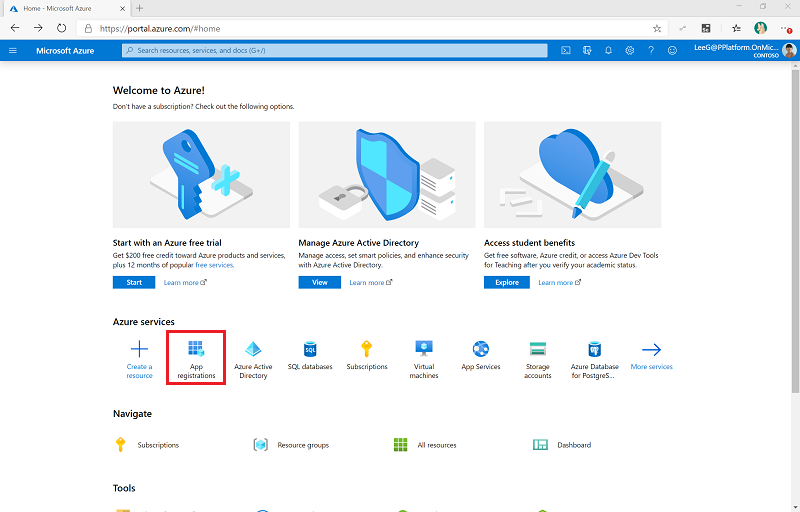

1. Select **+ New Registration**.

1. Enter **PowerOpsApp** as name, don't change any other setting, and then select **Register**.

   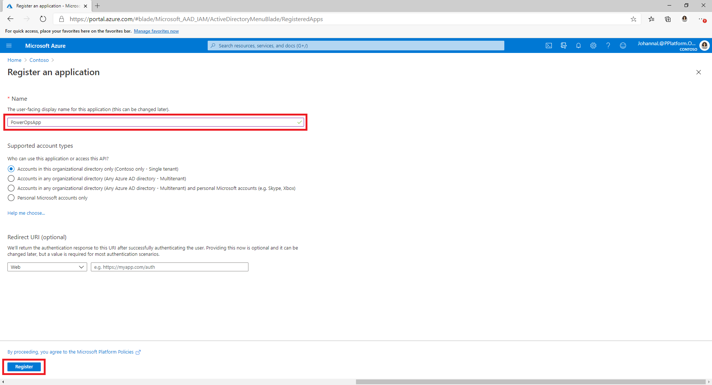

1. Select **API Permissions** > **+ Add a permission**.

1. Select **Dynamics CRM**, and configure permissions as follows:

   

   1. Select **Delegated permissions**, and then select **user_impersonation**.

      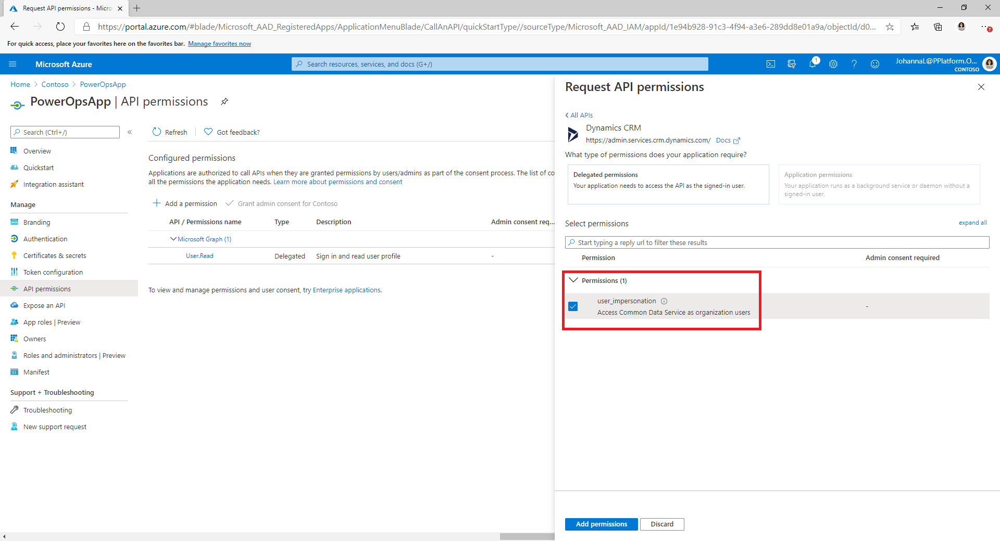

   1. Select **Add permissions**.

1. Select **Grant admin consent for [Your Organization]**
   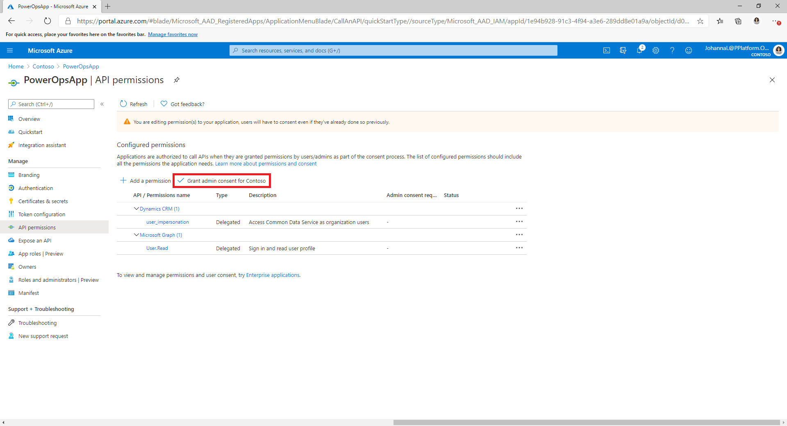

1. From the left navigation select **Authentication**.
1. Under **Advanced Settings** > **Allow public client flows** > Toggle **Enable the following mobile and desktop flows** to Yes.
   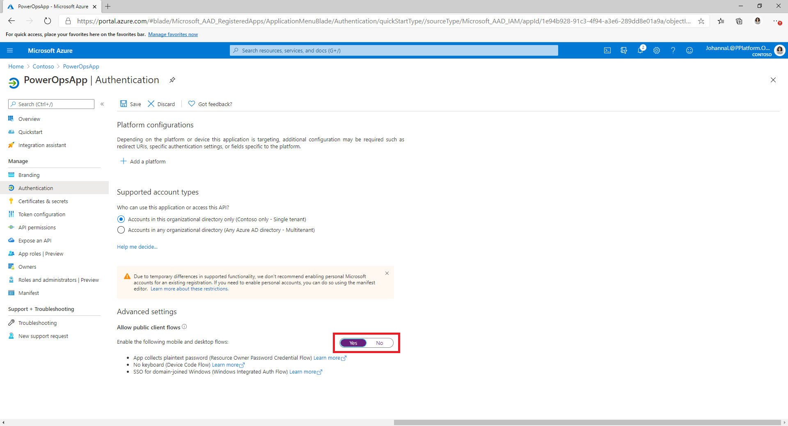
1. Select Save.
1. Select **Overview**, and copy and paste the application (client) ID value to notepad. You'll need this value in the next step as you configure the custom connector.

Leave the Azure portal open, because you'll need to make some configuration updates after you set up the custom connector.

## Import the solution

1. Download the CoE Starter Kit compressed file ([aka.ms/CoeStarterKitDownload](https://aka.ms/CoeStarterKitDownload)).

1. Extract the zip file.

1. Go to [make.powerapps.com](<https://make.powerapps.com>).

1. Go to your Development environment. In the example in the following image, we're importing to the environment named **Contoso CoE**.

     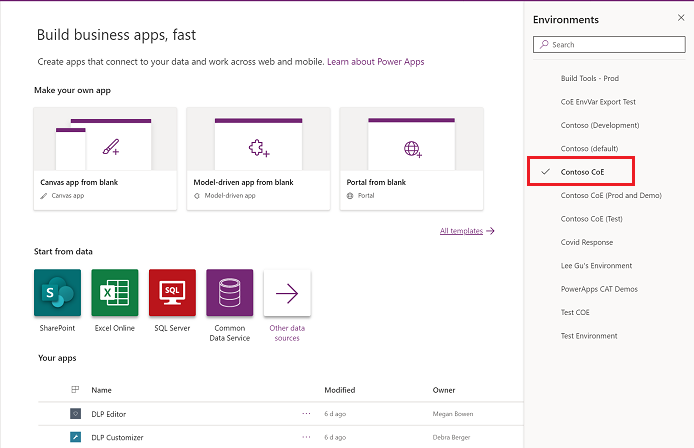

1. Create connections to all connectors used as part of the solution.
    1. Go to **Data** > **Connections**.
    1. Select **+ New Connection**.
    1. Search for and select **Common Data Service (current environment)**.
      connector")
    1. Select **+** to create a connection.
    1. Complete the same steps for the following connectors:
        - Office 365 Outlook
        - GitHub
        - Power Apps for Makers
        - Power Platform for Admins
        - Approvals
        - Content Conversion

1. On the left pane, select **Solutions**.

1. Select **Import**. A pop-up window appears. (If the window doesn't appear, be sure your browser's pop-up blocker is disabled and try again.)

1. In the pop-up window, select **Choose File**.

1. Select the PowerOps solution from File Explorer (PowerPlatformGitHubALM_x_x_x_xx_managed.zip).

1. When the compressed (.zip) file has been loaded, select **Next**.

1. Review the information, and then select **Next**.
1. Establish connections to activate your solution. If you create a new connection, you must select **Refresh**. You won't lose your import progress.

     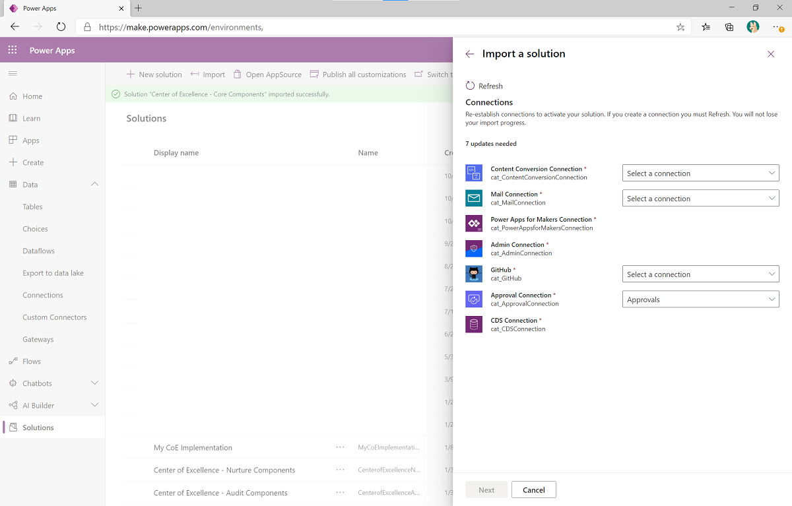

1. Select **Import**.

## Configure Environment Settings and Deployment Stages after import

1. Go to [make.powerapps.com](<https://make.powerapps.com>).
1. On the left pane, select **Solutions**.
1. Select the **Power Platform GitHub ALM** solution and open the **PowerOps Admin** app.

### Setup Deployment Stages

Update one row at a time and select **Update** to save your changes.

1. Update the **Stage Owner Email** for each of the three stages (DEV, TEST & PROD). The stage owner will receive notification for approving the project creation and deployment.
1. Update the **Admin username and password**. These credentials can be a service account or a user account with Power Platform Admin role.
1. For each of the Test and Production stages, select a pre-existing environment that will be used for Test and Production deployments. Your dev environment is the environment provisioned when you created a project in PowerOps.

### Update the "Webhook Url" value

This Url will be used as a callback URL from GitHub.

1. In a new tab, go to [make.powerapps.com](<https://make.powerapps.com>) > **Solutions** > **Power Platform GitHub ALM** solution.
1. Edit the **WorkflowCompleteNotification** flow.
1. Select the first action and copy the URL in the action
1. Go back to the **PowerOps Admin** app and update the **Webhook Url** with the value copied from the previous step.
1. Select **Update**.

### Update the Client ID

The Client ID is needed for flows to create an environment and perform other admin-related activities like fetching solutions and apps inside an environment.

1. In the PowerOps Admin app, update the Client ID with the Application (client) ID value you copied during [Create an Azure AD app registration](#create-an-azure-ad-app-registration).
1. Select **Update**

### Update the GitHub Org Name

1. Enter your GitHub org name (see [prerequisite](#prerequisites)). The repositories will be created inside this org.
1. Select Update.

### Update the language

1. Change your preferred language. Power Apps uses the [IETF BCP-47 language tag format](https://docs.microsoft.com/powerapps/maker/canvas-apps/functions/function-language#language-tags), for example en_US, fr_FR, it_IT.
1. Select Update.

### Update the “GitHub Plan Exist”

If there’s a Paid GitHub Org Plan that exists for your org. Toggle “GitHub Plan Exists” to On.

## Secure admin credentials

[Field level security](https://docs.microsoft.com/power-platform/admin/field-level-security) is enabled to secure credentials for deployments. As an admin, you will need to add users to the **FieldSecurityForPassword** field security profile to enable those users to add their credentials for the deployment from development to test and production environments.

Add users to the field security profile:

1. Go to [make.powerapps.com](https://make.powerapps.com/), select **Solutions**, and then open the **Power Platform GitHub ALM** solution.
1. Select **FieldSecurityForPassword** from the solution.

    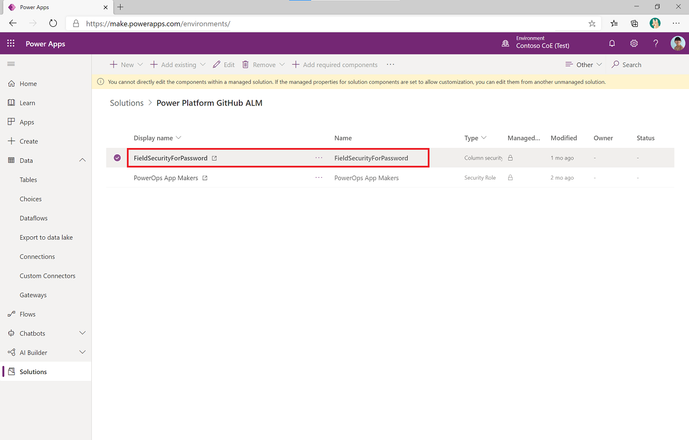
1. Select **Users**.

     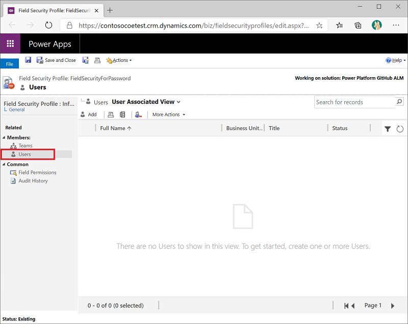
1. Select **Add**.
1. Search for Users.

    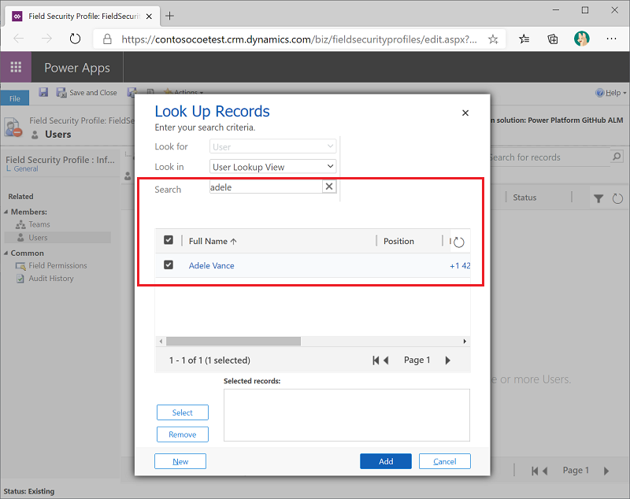
1. **Select** to add them to the security profile.

    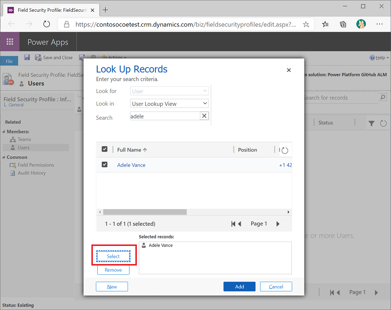
1. Repeat this step for all users that will use PowerOps.
1. Select **Save and Close**.

    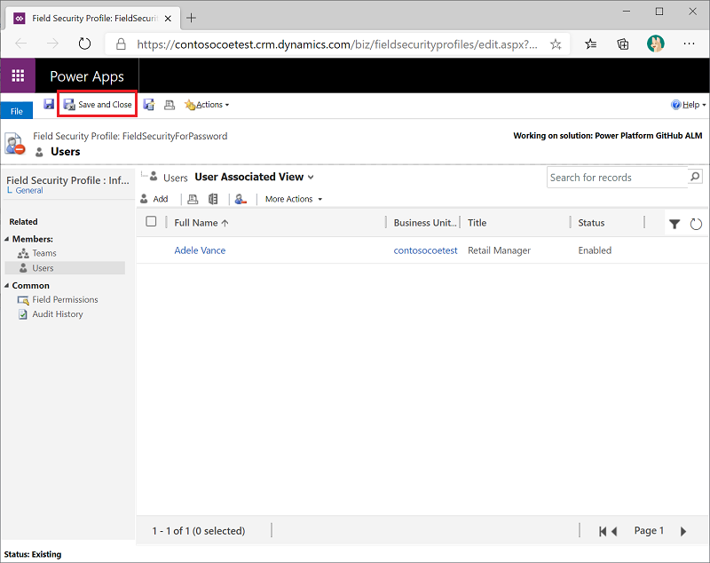

## Configure GitHub org secrets

GitHub Org secrets will be used to make API calls to import/export solutions and to interact with Microsoft Dataverse. Secrets are the recommended way of storing sensitive information.

GitHub supports org secrets and repository level secrets. If you have a paid plan, all the secrets created at the org level can be used by private repositories as well. That’s the advantage of having a paid plan. Otherwise, **the admin has to create secrets for all of the repositories**.

Learn more: [GitHub Team offerings](https://docs.github.com/free-pro-team@latest/github/getting-started-with-github/githubs-products#github-team).
The environment admin must have GitHub repo admin permissions to complete the below steps.

## Paid GitHub org plan

If you have a paid GitHub org plan, configure org secrets:

1. Navigate to your org in GitHub (https://github.com/yourorg).
1. Select **Settings** > **Secret** > **New organization secret**
    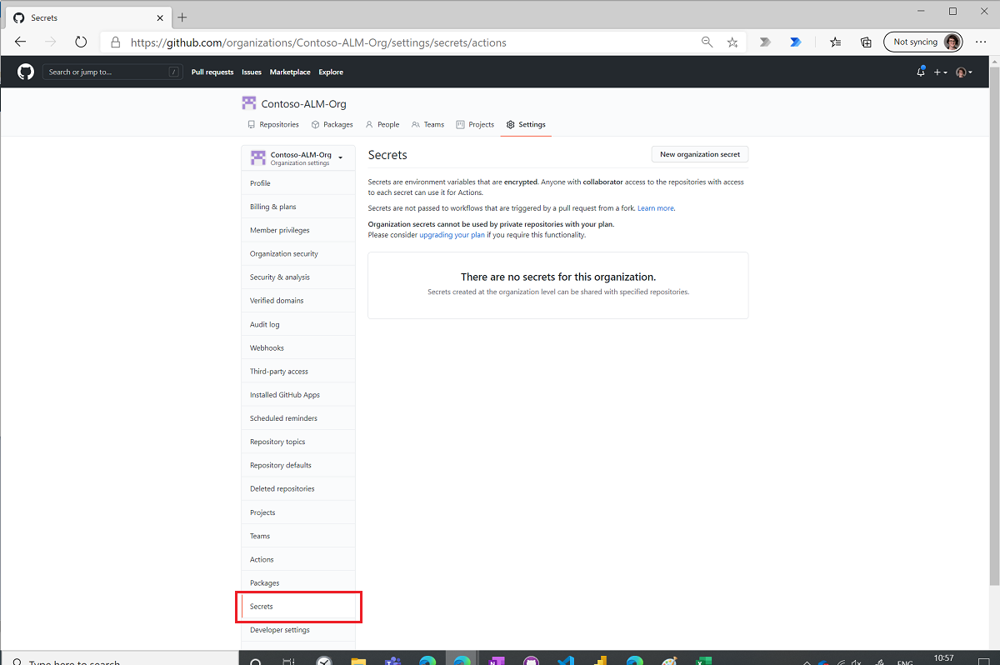
1. Enter **DEV_ENVIRONMENT_SECRET** as a secret name for your Dev deployment stage, and enter the value for your secret.
1. Select **Private Repositories** from the Repository access dropdown.
         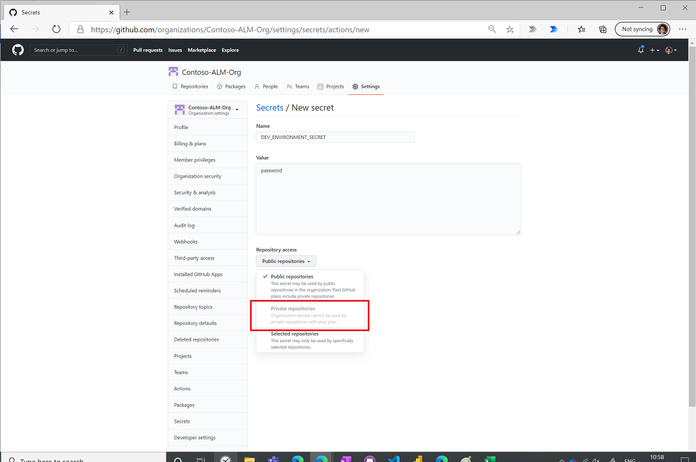
1. Select **Add Secret**.
1. Complete the above steps to add a **TEST_ENVIRONMENT_SECRET** and **PROD_ENVIRONMENT_SECRET**.

## Free GitHub org plan

If you do not have a paid GitHub org plan, follow the below steps for all projects created in PowerOps.

These steps need to be followed for all projects created in PowerOps.

1. Navigate to your org in GitHub (https://github.com/yourorg).
1. Select **Settings** > **Secret** > **New organization secret**
1. Enter **DEV_ENVIRONMENT_SECRET** as a secret name for your Dev deployment stage, and enter the value for your secret.
    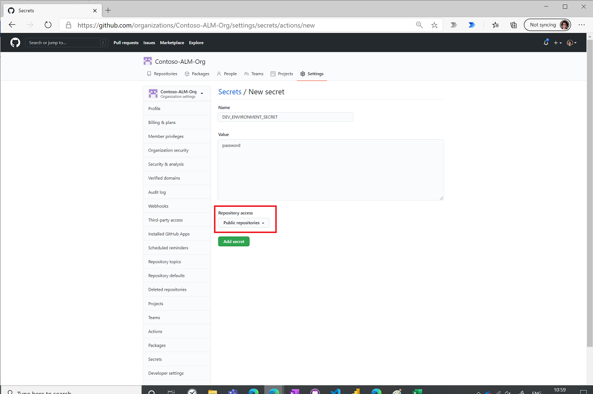
1. Select **Add Secret**.
1. Complete the above steps to add a **TEST_ENVIRONMENT_SECRET** and **PROD_ENVIRONMENT_SECRET**.

You can now use the PowerOps components.

# Use PowerOps components

The PowerOps components will help you follow best DevOps practices to source control and move your solution(s) from development to test to production environments using GitHub. More information: [Set up PowerOps components](#set-up-powerops-components)

The PowerOps components enable makers to apply source control strategies using GitHub and use automated builds and deployment of solutions to their environments without the need for manual intervention by the maker, administrator, developer, or tester. In addition PowerOps provides makers the ability to work without intimate knowledge of the downstream technologies and to be able to switch quickly from developing solutions to source controlling the solution and ultimately pushing their apps to other environments with as few interruptions to their work as possible.

The PowerOps app shows a maker all of their projects and allows them to deploy their work in progress or final solution to a test and production environment.
Once a new project is created and approved, makers can navigate to [make.powerapps.com](https://make.powerapps.com) to build and create assets - such as apps, flows, and tables - in a solution that has been created for them.

**Prerequisite**: This app uses Microsoft Dataverse; a Premium license is therefore required for every app user.

1. Go to [make.powerapps.com](<https://make.powerapps.com>).
1. On the left pane, select **Solutions**.
1. Select the **Power Platform GitHub ALM** solution and open the **PowerOps** app. You may need to launch the app in an In Private browser session if the app fails to load.

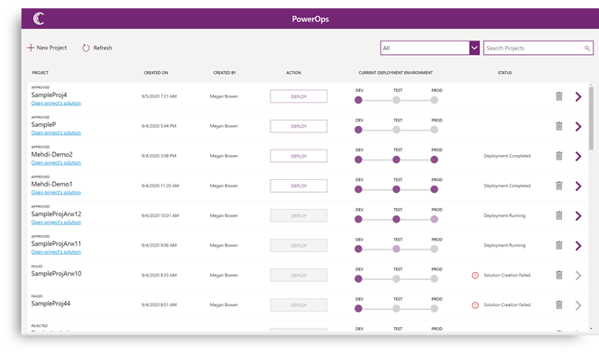

The app dashboard shows all projects created by your user.

## Request approval for a new project

- Select **New Project** to create your first project.
- Enter a name and description (optional) and select **Create Project**.

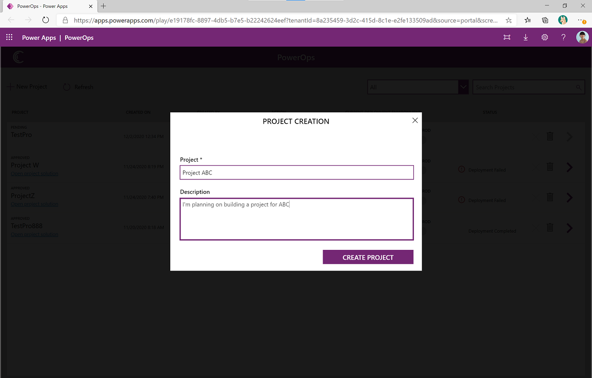

When a user submits this request, an Approval request is sent to a pre-defined administrator. The admin will review the request and approve or reject the request. Once a project is created and approved, navigate to the maker portal to build and create resources (apps, flows, entities, and so on) under a newly created solution for your project.

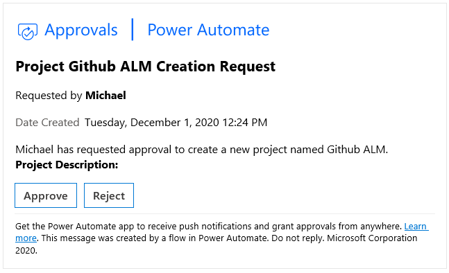

## Create an environment and GitHub repository

When an administrator approves a project, a new environment with a Microsoft Dataverse database is created. This environment is dedicated to the maker and their solution. By default, this developer environment is set to expire in 30 days, but users can request an extension.  

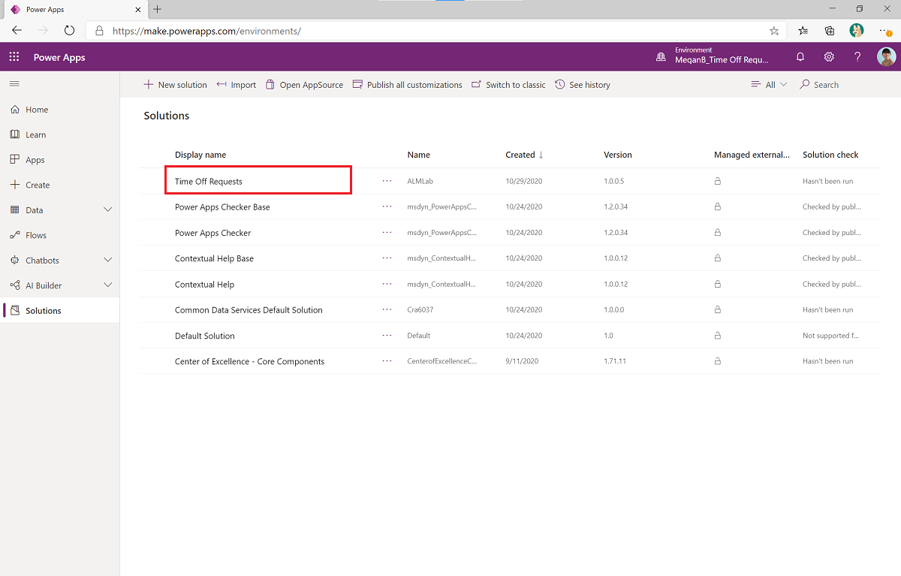

A GitHub repository is also created. This repository will be used to persist all of the resources of the project contained in the solution.

## Open your project

When a project is approved, the **Deploy** button is activated and a link to the solution is shown. A user can navigate to the maker portal directly and open their solution in the newly created environment.

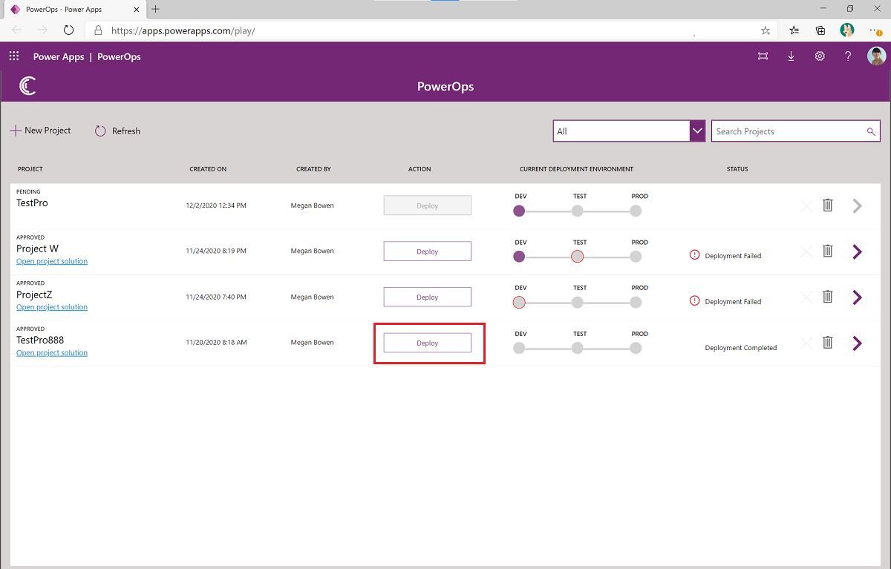

## Deploy your project to test

A maker can deploy to a test environment at any point during their development phase. No approval is required for a maker to deploy a test environment.
When deploying to test, the solution for this project is also checked in to the GitHub repository under a developer branch.

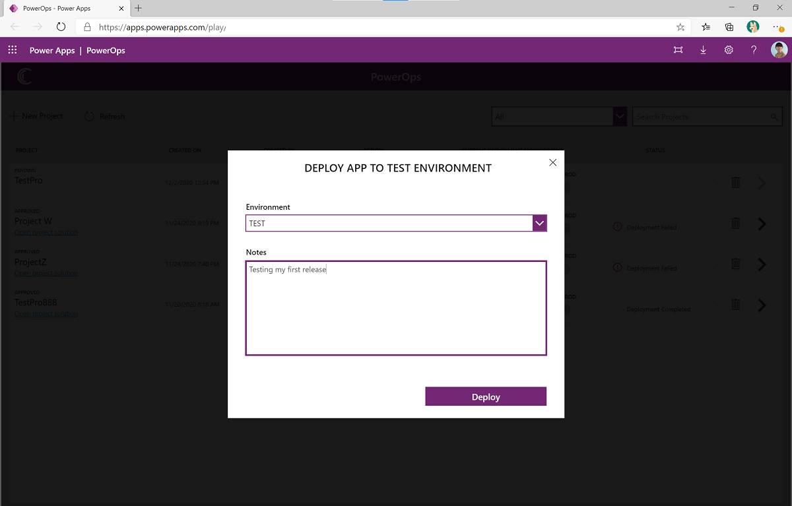

## View deployment status

PowerOps will show the status of the deployment. When a deployment is completed or fails, both the admin and the app maker will receive an email notification with the details. If the deployment is successful, the notification email will have links to the environment where the solution has been deployed.  

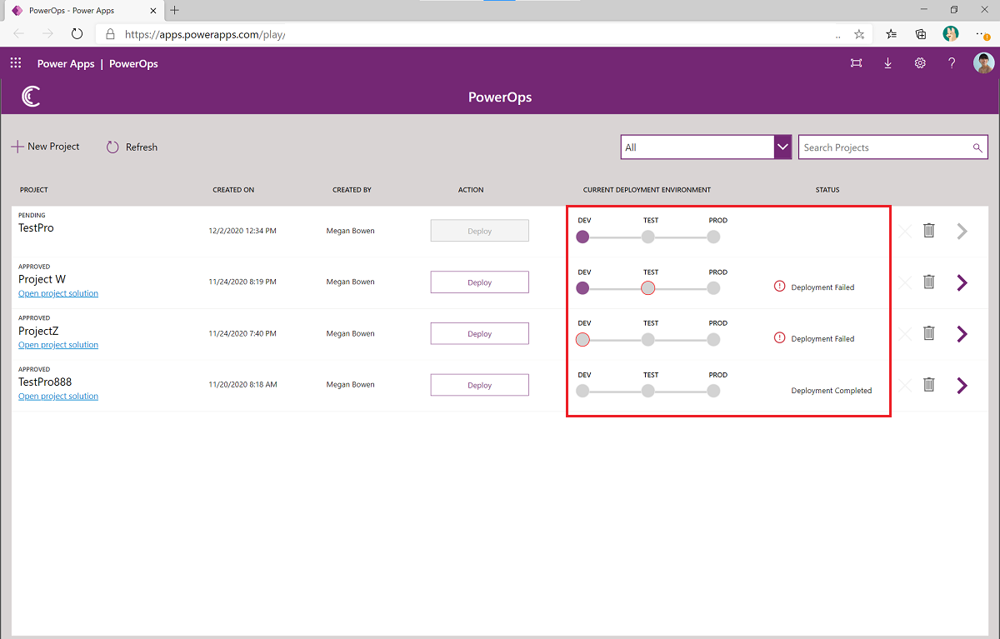

## View build details

Admins can monitor the progress of step by step within the **Actions** tab of the GitHub repo.
They can also check out the cloud flows used to orchestrate the deployment.

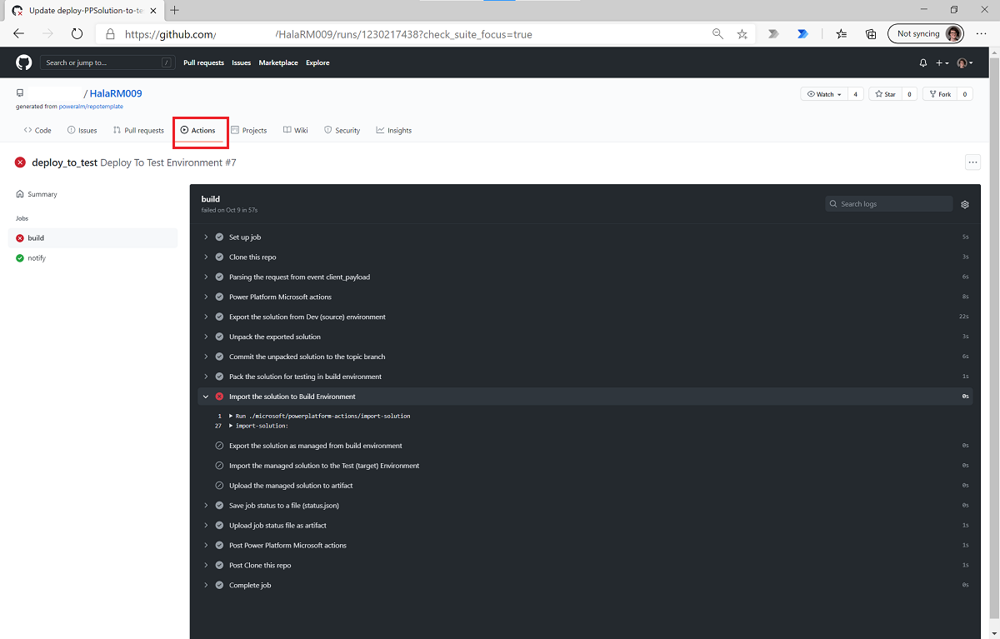

## Deploy your project to production

Before a maker can deploy to production, the deployment to test has to succeed. An approval from an administrator is required to deploy to a production environment.
When deploying to test, a pull request is created and when the deployment request is approved, the solution for the project is merged into the main branch in the GitHub repo.

## View deployment history

Makers can check the deployment history for their project by navigating to the detail pages for their project (using > arrow)

## Troubleshooting section
- If you are seeing error in creating new project.
  We have identified a known issue in some regions.
  Where create project flow fails for creating a repo in an organisation with 403 forbidden error.

  You can follow the below workaround until the issue is fixed:
  In "Power Platform Github ALM" component you can edit the environment variable cat_TemplateRepoName current value to poweralm/repotemplate.

