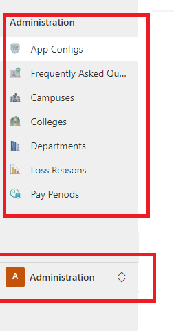
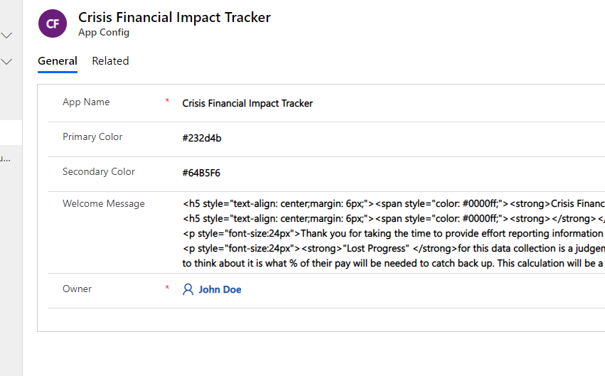
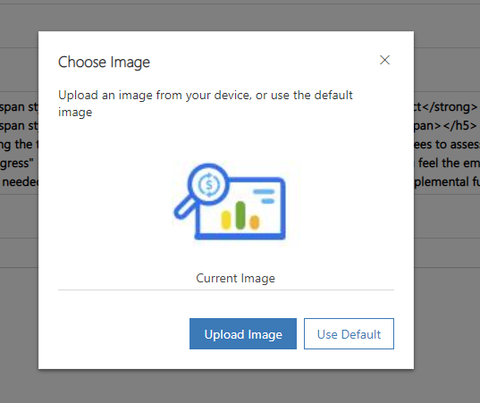
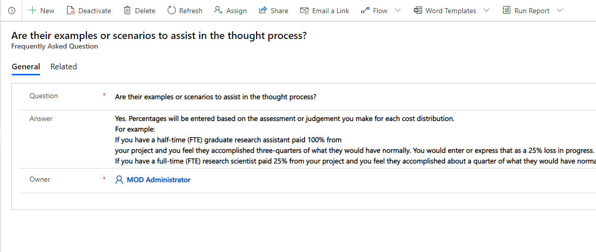
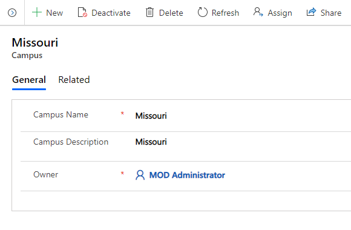
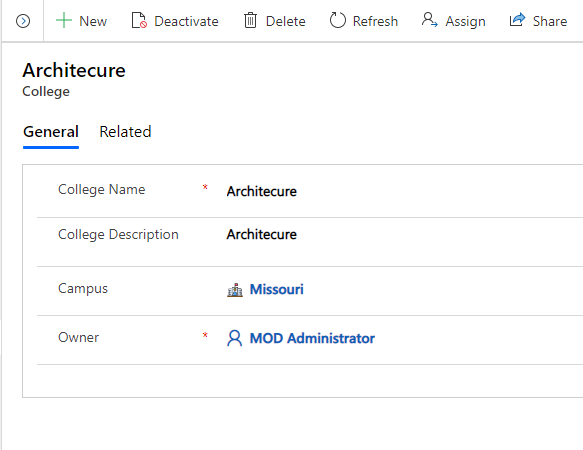
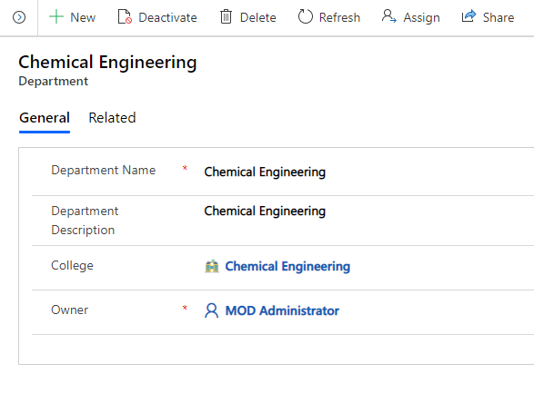
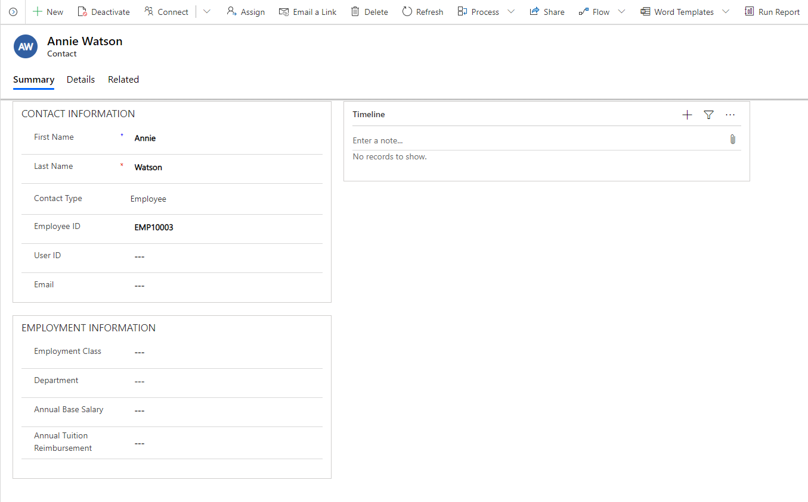
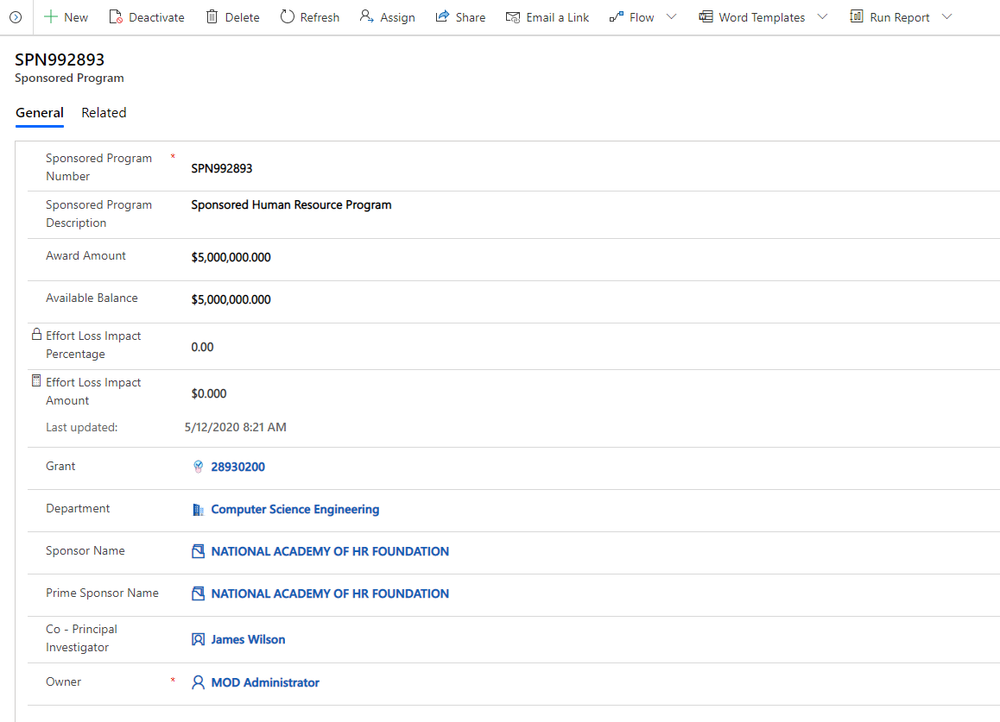

# Configure master data in the admin app

This article provides information on how you can use the admin app (model-driven app) to add and manage master data for your solution.

These tasks are typically performed by business admins in your organization.

Estimated time to complete these steps: **35–40 minutes.**

## Step 1: Configure and manage setup data for your organization

Use the admin app to create and manage master data for your organization. This data is required for the **Crisis Financial Impact Tracker** app to work.

> [!IMPORTANT]
> Ensure that your IT admin has deployed the solution into your organization and has granted appropriate permissions for business admins to use the admin app.
More information: [Deploy the Crisis Financial Impact Tracker app](deployment.md).

You must add master data in to these entities in the following sequence:

1. [App Configs](#app-configs)

2. [Frequently Asked Questions](#frequently-asked-questions)

3. [Campuses](#campuses)

4. [Colleges](#colleges)

5. [Departments](#departments)

6. [Loss Reasons](#loss-reasons)

7. [Pay Period](#pay-periods)

The master data is managed from the **Administration** area in the left navigation pane in the admin app:

> 

### App Configs

The App Configs entity lets you manage key configurations of the applications. To
update the App Configs entity record:

1. Sign in to the admin app (model-driven app) using the URL provided by your IT admin.

1. Select **Administration** > **App Configs** in the left navigation pane.

   
   > 

1. Select the record.
    
    > 

1. Enter or update the fields with appropriate values:

    | Field | Description|
    |------------|--------------|
    | App Name  | Enter the name of the app. |
    | Primary Color| Enter the primary color for the app.|
    | Secondary Color | Enter the secondary color for the app.|
    | Welcome Message | Enter the HTML based welcome message that you want to display on the app.|
    | Owner| The owner field automatically default to your user. |

1. Double-click on the image on the form to update with the new one.
    
    
    > 

1. Select the **Upload Image** to select a new image for your app.
    
    
    > 

### Frequently asked questions 

The Frequently Asked Questions entity lets you manage and maintain frequently asked questions which helps the app users to create records. To create a new frequently asked questions record:

1. Sign in to the admin app (model-driven app) using the URL provided by your IT admin.

1. Select **Administration** > **Frequently Asked Questions** in the left  navigation pane and select **New**.

1. Enter the following field value to create a new record:

   
   > 

   | Field    | Description |
   |----------|----------------|
   | Question | Enter the frequently asked question for the app users.|
   | Answer   |Enter the answer for the question above, which is suitable for the app users.|
   | Owner| The owner field automatically defaults to the user.|

1. Select **Save & Close**. The newly created record will be available in the
    **Frequently asked questions** list.

To edit the record, select the record, update the values as required, and select
**Save & Close.**

### Campuses

The Campuses entity lets you manage and maintain university campuses, which will
be participated in this program. To create the record:

1. Sign in to the admin app (model-driven app) using the URL provided by your IT admin.

1. Select **Administration** > **Campuses** in the left navigation pane and select **New**.

1. Enter the following field values to create a new record:

   
   > 

   | Field  | Description |
   |---------|-----|
   | Campus Name | Enter the name of the campus.|
   | Campus Description | Enter the description of the campus.|
   | Owner| The owner field automatically defaults to your user. |

1. Select **Save & Close**. The newly created record will be available on the
    **Campus** list.

To edit the record, select the record, update the values as required, and select
**Save & Close.**

### Colleges

The colleges entity lets you manage and maintain colleges of
the University campuses, which will be participated in this program. To create
the record:

1. Sign in to the admin app (model-driven app) using the URL provided by your IT admin.

1. Select **Administration** > **Colleges** in the left navigation pane and select **New**.

1. Enter the following field values to create a new record:

    
    > 

    | Field  | Description  |
    |------------|-------------|
    | College Name | Enter the name of the college/school. |
    | College Description | Enter the description of the college/school.|
    | Campus | Select a campus this college/school is associated with this college. This list is populated based on the **Campus** data you have created earlier. |
    | Owner | The owner field automatically defaults to your user.|

1. Select **Save & Close**. The newly created record will be available in the
    **College** list.

To edit the record, select the record, update the values as required, and select
**Save & Close.**

### Departments

The Department entity lets you manage and maintain departments of each
college, which will be participated in this program. To create the
record:

1. Sign in to the admin app (model-driven app) using the URL provided by your IT admin.

1. Select **Administration** > **Departments** in the left navigation pane and select **New**.

1. Enter the following field values to create a new record:

   
   > 

    | Field  | Description   |
    |-------------|---------|
    | Department | Enter the name of the department.|
    | Department Description | Enter the description of the department.|
    | College | Select a college this department is associated with. This list is populated based on the **College** data you have created earlier. |
    | Owner  | The owner will automatically default to your user. |

1. Select **Save & Close**. The newly created record will be available in the
    **Department** list.

To edit the record, select the record, update the values as required, and select
**Save & Close.**

### Loss Reasons

The Loss Reason entity lets you manage and maintain loss reason associated
with the effort impact. To create the record:

1. Sign in to the admin app (model-driven app) using the URL provided by your IT admin.

1. Select **Administration** > **Loss Reason** in the left navigation pane and select **New**.

1. Enter the following field values to create a new record:

   
   > 

   | Field   | Description |
   |-----------|--------------|
   | Loss Reason Code | Enter the code for the Loss Reason.|
   | Loss Reason Description | Enter the description of the Loss Reason.|
   | Owner | The owner field automatically defaults to your user. |

1. Select **Save & Close**. The newly created record will be available in the
    **Loss Reason** list.

To edit the record, select the record, update the values as required, and select
**Save & Close.**

### Pay Periods

The Pay Period entity lets you manage and maintain the reporting
period associated with the effort impact. To create the record:

1. Sign in to the admin app (model-driven app) using the URL provided by your IT admin.

1. Select **Administration** > **Pay Period** in the left navigation pane and select **New**.
1. Enter the following field values to create a new record:

   
   > 

    | Field | Description |
    |-----------|--------------|
    | Pay Period Code | Enter the code of the Loss Reason.|
    | Pay Period Description | Enter the description of the Loss Reason.|
    | Owner  | The owner field automatically defaults to your user. |

1. Select **Save & Close**. The newly created record will be available in the
    **Loss Reason** list.

To edit the record, select the record, update the values as required, and select
**Save & Close.**

## Step 2: Configure and manage master data for your organization

Use the admin app to create and manage master data for your organization. This data is required for the **Crisis Financial Impact Tracker** app to work.

You must add master data in these entities in the following sequence:

1. [Employees](#employees)

2. [Sponsors](#sponsors)

3. [Grants](#grants)

4. [Sponsored Programs](#sponsored-programs)

5. [Employee Compensation](#employee-compensation)

The master data is managed from the **Crisis Financial Impact Tracker** area in the left navigation pane in the admin app:

> 

### Employees

The Employees entity lets you manage and maintain the employees that are
associated with the sponsored program in different roles like Principal
Investigator, Co-Principal Investigator, Researcher, etc.

To create the record:

1. Sign in to the admin app (model-driven app) using the URL provided by your IT admin.

1. Select **Crisis Financial Impact Tracker** > **Employees** in the left navigation pane and select **New**.

1. Enter the following field values to create a new record:

   
   > 

   | Field  | Description |
   |--------|-----------|
   | Contact Type | Enter the type of contact. |
   | Employee ID  | Enter the employee id or number for the contact for reference in orders, service cases, or other communications with the contact's organization.|
   | User ID  | Enter the user id. |
   | Email| Enter the primary email address for the contact. |
   | First Name | Enter the employee's first name to make sure the contact is addressed correctly in sales calls, email, and marketing campaigns.|
   | Last Name   | Enter the employee's last name to make sure the contact is addressed correctly in sales calls, email, and marketing campaigns.|
   | Middle Name | Enter the employee's middle name or initial to make sure the contact is addressed correctly.|
   | Employment Class | Enter the classification of employees. |
   | Department | Enter the department where the employee works.|
   | Annual Base Salary | Enter the annual base salary of the employee.|
   | Annual Tuition Reimbursement | Enter the annual tuition reimbursement of the employee .|

   > [!NOTE] 
   > Email address of the employee must match the employee email id of the user accessing the app.

1. Select **Save & Close**. The newly created record will be available on the **Employee** list.

To edit the record, select the record, update the values as required, and select
**Save & Close.**

### Sponsors

The Sponsor entity lets you manage and maintain the sponsors that are
associated with the sponsored program.

To create the record:

1. Sign in to the admin app (model-driven app) using the URL provided by your IT admin.

1. Select **Crisis Financial Impact Tracker** > **Sponsors** in the left navigation pane, and select **New**.

1. Enter the following field values to create a new record:

   
   > 

    | Field   | Description |
    |---------|------------|
    | Account Name  | Enter the name of the sponsor.|
    | Phone  | Enter the primary phone number of the sponsor.|
    | Fax   | Enter the fax number of the sponsor. |
    | Website  | Enter the website of the sponsor.|
    | Parent Account | Select the parent account associated with this sponsor.|

1. Select **Save & Close**. The newly created record will be available on the
    **Sponsor** list.

To edit the record, select the record, update the values as required, and select
**Save & Close.**

### Grants

The Grants entity lets you manage and maintain the grants that are associated with the sponsored program.

To create the record:

1. Sign in to the admin app (model-driven app) using the URL provided by your IT admin.

1. Select **Crisis Financial Impact Tracker** > **Grants** in the left navigation pane and select **New**.

1. Enter the following values to create a new record:

   
   > 

    | Field  | Description |
    |---------|--------------|
    | Grant Number | Enter the grant number.|
    | Grant Title | Enter the title of the grant.|
    | Grant Description| Enter the description of the grant.|
    | Grant Status | Select the status for the grant.|
    | Principal Investigator | Select the principal investigator.|
    | Start Date | Enter the start date of the grant.|
    | End Date| Enter the end date of the grant|
    | Owner | The owner field automatically defaults to your user. |

1. Select **Save & Close**. The newly created record will be available on the
**Grant** list.

To edit the record, select the record, update the values as required, and select
**Save & Close.**

### Sponsored Programs

The Sponsored Program entity lets you manage and maintain the sponsored program that is associated with the Grants entity.

To create the record:

1. Sign in to the admin app (model-driven app) using the URL provided by your IT admin.

1. Select **Crisis Financial Impact Tracker** > **Sponsored Program** in the left navigation pane and select **New**.

1. Enter the following values to create a new record:

    
    > 

    | Field  | Description  |
    |-------------|--------------|
    | Sponsored Program Number  | Enter the number of the sponsored program.|
    | Sponsored Program Description | Enter the description of the sponsored program.|
    | Award Amount | Enter of the award amount for the sponsored program.|
    | Available Balance  | Enter of the balance amount for the sponsored program.|
    | Effort Loss Impact Percentage | Enter the percentage of total loss impact.|
    | Effort Loss Impact Amount | Enter of the total loss impact amount for the sponsored program.|
    | Grant | select the grant this sponsored program is associated with.|
    | Department | Select the department of the sponsored program.|
    | Sponsor Name | Select the sponsor name of the sponsored program.|
    | Prime Sponsor Name | Select the prime sponsor name of the sponsored program.|
    | Co-Principal Investigator| Select the co-principal investigator name of the sponsored program. |
    | Owner  | The owner field automatically defaults to your user. |

1. Select **Save & Close**. The newly created record will be available on the
    **Sponsored Programs** list.

To edit the record, select the record, update the values as required, and select
**Save & Close.**

### Employee Compensation 

The Employee Compensation entity lets you manage and maintain the employee
effort amount, effort loss, and reason by pay period for each
sponsored program.

To create the record:

1. Sign in to the admin app (model-driven app) using the URL provided by your IT admin.

1. Select **Crisis Financial Impact Tracker** > **Employee Compensation** in the left navigation pane and select **New**.

1. Enter the following values to create a new record:

   
   > 

   | Field     | Description  |
   |-------------|----------------------|
   | Employee  | Select the employee. |
   | Sponsored Program | Select the sponsored program. |
   | FTE    | Enter the full-time equivalent. |
   | Pay Period   | Select the pay period. |
   | Pay Group   | Select the pay group.|
   | Pay Rate    | Enter the pay rate. |
   | Effort Percentage | Enter the effort percentage. |
   | Effort Amount     | Enter the effort amount. |
   | Loss Percentage   | Enter the effort percentage. |
   | Loss Amount  | Enter the loss amount.|
   | Loss Reason  | Select the loss reason. |
   | Owner   | The owner field automatically defaults to your user. |

1. Select **Save & Close**. The newly created record will be available on the
    **Sponsored Programs** list.

To edit the record, select the record, update the values as required, and select
**Save & Close.**
