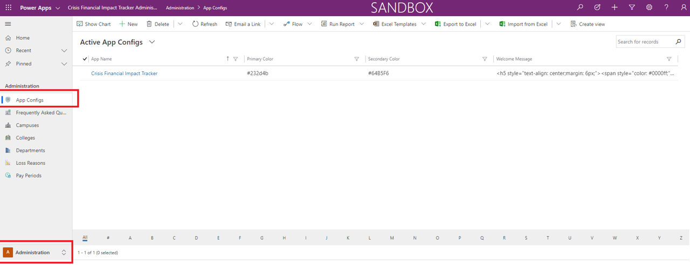
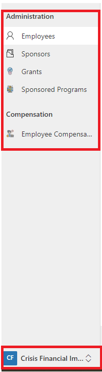
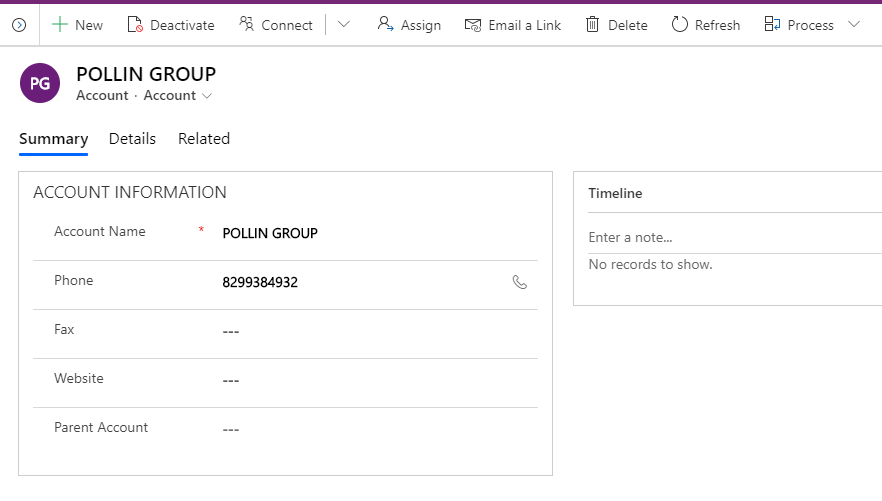
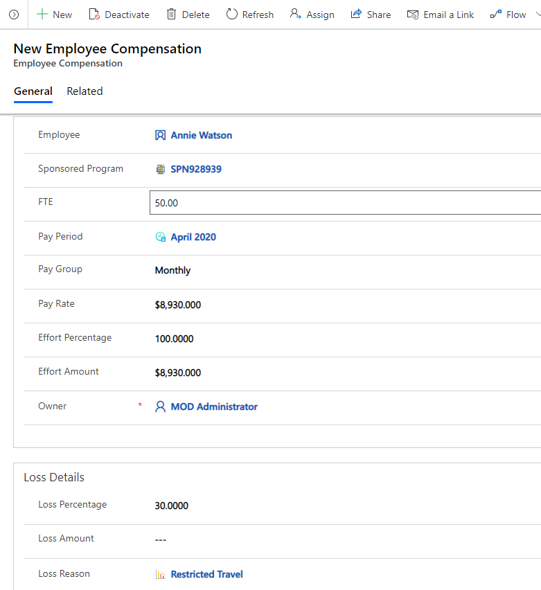

# Configure Master Data in Admin App

This article provides information on how you can use the admin app (model-driven
app) to add and manage master data for your solution.

These tasks are typically performed by business admins in your organization.

Estimated time to complete these steps: **35–40 minutes.**

## Step 1: Configure and manage setup data for your organization

Use the admin app to create and manage master data for your organization. This
data is required for the Financial Impact Tracker app to work.

> [Important]

> Ensure that your IT Admin has deployed the solution in your organization and
has granted appropriate permissions for business admins to use the admin app.
More information: Deploy the Financial Impact Tracker App.*

You must add master data in these entities in the following sequence:

1.  [App Config](#app-config)

2.  [Frequently Asked Questions](#frequently-asked-questions)

3.  [Campuses](#campuses)

4.  [Colleges / Schools](#colleges-schools)

5.  [Departments](#departments)

6.  [Loss Reasons](#loss-reasons)

7.  [Pay Period/ Reporting Period](#pay-reporting-periods)

The master data is managed from the Administration area in the left navigation
in the admin app:

### App Config

The App Config entity lets you manage key configurations of the applications. To
update the record:

1.  Sign in to the admin (model-driven app) using the URL provided by your IT
    Admin

2.  Select Administration -\> App Config in the left pane

1.  Click on the app name record

    

2.  On the detail page, enter or update appropriate values

| Field           | Description                                                                                           |
|-----------------|-------------------------------------------------------------------------------------------------------|
| App Name        | Type a name of the app                                                                                |
| Primary Color   | Type the primary color for the Mobile Power App                                                       |
| Secondary Color | Type the secondary color for the Mobile PowerApp                                                      |
| Welcome Message | Provide HTML based welcome message which you will want to display a welcome message on the mobile app |
| Owner           | The owner will automatically default to your user.                                                    |

3.  Double click on the icon on the form to update with the logo.

1.  Upload a new image/ logo for your app.

Frequently asked questions 
---------------------------

The Frequently asked questions entity lets you manage and maintain frequently
asked questions which may be useful for mobile app users To create the record:

1.  Sign in to the admin (model-driven app) using the URL provided by your IT
    Admin

2.  Select Administration -\> Frequently asked questions in the left pane, and
    select **New**

3.  In the **New Frequently asked questions** page, specify an appropriate value

| Field    | Description                                                                      |
|----------|----------------------------------------------------------------------------------|
| Question | Type a question as a frequently asked question for the mobile app users          |
| Answer   | Type the answer for the questions above, which suitable for the mobile app users |
| Owner    | The owner will automatically default to your user.                               |

1.  Select **Save & Close**. The newly created record will be available in the
    **Frequently asked questions** list.

To edit the record, select the record, update the values as required, and select
**Save & Close.**

### Campuses

The Campuses entity lets you manage and maintain University campuses, which will
be participated in this program. To create the record:

1.  Sign in to the admin (model-driven app) using the URL provided by your IT
    Admin

2.  Select Administration -\> Campuses in the left pane, and select **New**

3.  In the **Campus** page, specify an appropriate value

| Field              | Description                                        |
|--------------------|----------------------------------------------------|
| Campus Name        | Type the name of the campus                        |
| Campus Description | Type a brief description of the campus             |
| Owner              | The owner will automatically default to your user. |

1.  Select **Save & Close**. The newly created record will be available on the
    **Campus** list.

To edit the record, select the record, update the values as required, and select
**Save & Close.**

### Colleges / Schools

The Colleges / School entity lets you manage and maintain Colleges/schools of
the University campuses, which will be participated in this program. To create
the record:

1.  Sign in to the admin (model-driven app) using the URL provided by your IT
    Admin

2.  Select Administration -\> **Colleges / Schools** in the left pane, and
    select **New**

3.  In the **Colleges / Schools** page, specify an appropriate value

| Field                        | Description                                                                                                                                        |
|------------------------------|----------------------------------------------------------------------------------------------------------------------------------------------------|
| College/ School Name         | Type the name of the College/ School                                                                                                               |
| College / School Description | Type a brief description of the College / School                                                                                                   |
| Campus                       | Select a campus this college/ school is associated with this college. This list is populated based on the **Campus** data you have created earlier |
| Owner                        | The owner will automatically default to your user.                                                                                                 |

1.  Select **Save & Close**. The newly created record will be available in the
    **College / School** list.

To edit the record, select the record, update the values as required, and select
**Save & Close.**

### Departments

The **Department** entity lets you manage and maintain Departments of each
college/ school, which will be participated in this program. To create the
record:

1.  Sign in to the admin (model-driven app) using the URL provided by your IT
    Admin

2.  Select Administration -\> Departments in the left pane, and select **New**

3.  In the **Departments** page, specify the appropriate value

| Field                  | Description                                                                                                                        |
|------------------------|------------------------------------------------------------------------------------------------------------------------------------|
| Department             | Type the name of the department                                                                                                    |
| Department Description | Type a brief description of the department                                                                                         |
| College                | Select a College this department is associated with. This list is populated based on the **College** data you have created earlier |
| Owner                  | The owner will automatically default to your user.                                                                                 |

1.  Select **Save & Close**. The newly created record will be available in the
    **Department** list.

To edit the record, select the record, update the values as required, and select
**Save & Close.**

### Loss Reasons

The **Loss Reason** entity lets you manage and maintain Loss Reason associated
with the effort impact. To create the record:

1.  Sign in to the admin (model-driven app) using the URL provided by your IT
    Admin

2.  Select Administration -\> Loss Reason in the left pane, and select **New**

3.  In the **Loss Reasons** page, specify the appropriate value

| Field                   | Description                                        |
|-------------------------|----------------------------------------------------|
| Loss Reason Code        | Type the code of the Loss Reason                   |
| Loss Reason Description | Type a brief description of the Loss Reason        |
| Owner                   | The owner will automatically default to your user. |

1.  Select **Save & Close**. The newly created record will be available in the
    **Loss Reason** list.

To edit the record, select the record, update the values as required, and select
**Save & Close.**

### Pay / Reporting Periods

The **Pay / Reporting Period** entity lets you manage and maintain the reporting
period associated with the effort impact. To create the record:

1.  Sign in to the admin (model-driven app) using the URL provided by your IT
    Admin

2.  Select Administration -\> Pay / Reporting Period in the left pane, and
    select **New**

3.  In the **Pay Period** page, specify the appropriate value

| Field                  | Description                                        |
|------------------------|----------------------------------------------------|
| Pay Period Code        | Type the code of the Loss Reason                   |
| Pay Period Description | Type a brief description of the Loss Reason        |
| Owner                  | The owner will automatically default to your user. |

1.  Select **Save & Close**. The newly created record will be available in the
    **Loss Reason** list.

To edit the record, select the record, update the values as required, and select
**Save & Close.**

## Step 2: Configure and manage master data for your organization

Use the admin app to create and manage master data for your organization. This
data is required for the Financial Impact Tracker app to work.

You must add master data in these entities in the following sequence:

1.  Employees

2.  Sponsors

3.  Grants

4.  Sponsored Programs

5.  Employee Compensation

The master data is managed from the **Research Impact Loss** area in the left
navigation in the admin app:

### Employees

The **Employee** entity lets you manage and maintain the Employees that are
associated with the sponsored program in different roles like Principal
Investigator, Co-Principal Investigator, Researcher, etc.

To create the record:

1.  Sign in to the admin (model-driven app) using the URL provided by your IT
    Admin

2.  Select Research Impact Loss -\> Employees in the left pane, and select
    **New**

3.  In the **Employee** page, specify the appropriate value

| Field                        | Description                                                                                                                                     |
|------------------------------|-------------------------------------------------------------------------------------------------------------------------------------------------|
| Contact type                 | Type of Contact                                                                                                                                 |
| Employee ID                  | Type the employee ID or number for the contact for reference in orders, service cases, or other communications with the contact's organization. |
| User Id                      | Type the User ID                                                                                                                                |
| Email                        | Type the primary email address for the contact.                                                                                                 |
| First Name                   | Type the employee's first name to make sure the contact is addressed correctly in sales calls, email, and marketing campaigns.                  |
| Last Name                    | Type the employee's last name to make sure the contact is addressed correctly in sales calls, email, and marketing campaigns.                   |
| Middle Name                  | Type the employee's middle name or initial to make sure the contact is addressed correctly.                                                     |
| Employment Class             | Type the classification of employee                                                                                                             |
| Department                   | Type the department where the employee works                                                                                                    |
| Annual Base Salary           | Amount of the Base Salary of the employee                                                                                                       |
| Annual Tuition Reimbursement | Amount of the Annual Tuition Reimbursement of the employee                                                                                      |

>   *Note: Email address of the employee must match the employee email id of the
>   user accessing the powerApp.*

1.  Select **Save & Close**. The newly created record will be available on the
    **Employee** list.

To edit the record, select the record, update the values as required, and select
**Save & Close.**

### Sponsors

The **Sponsor** entity lets you manage and maintain the Sponsors that are
associated with the sponsored program.

To create the record:

1.  Sign in to the admin (model-driven app) using the URL provided by your IT
    Admin

2.  Select Research Impact Loss -\> Sponsors in the left pane, and select
    **New**

3.  In the **Sponsors** page, specify the appropriate value

| Field          | Description                                            |
|----------------|--------------------------------------------------------|
| Account Name   | Type the name of the sponsor                           |
| Phone          | Type the primary phone number of sponsor               |
| Fax            | Type the fax number of sponsor                         |
| Website        | Type the website of the sponsor                        |
| Parent Account | Select the Parent Account associated with this sponsor |

1.  Select **Save & Close**. The newly created record will be available on the
    **Sponsor** list.

To edit the record, select the record, update the values as required, and select
**Save & Close.**

### Grants

The **Grants** entity lets you manage and maintain the Sponsors that are
associated with the sponsored program.

To create the record:

1.  Sign in to the admin (model-driven app) using the URL provided by your IT
    Admin

2.  Select Research Impact Loss -\> Grants in the left pane, and select **New**

3.  In the **Grants** page, specify the appropriate value

| Field                  | Description                                        |
|------------------------|----------------------------------------------------|
| Grant Number           | Type the number of the Grant                       |
| Grant Title            | Type the title of the Grant                        |
| Grant Description      | Type the description of the Grant                  |
| Grant Status           | Select the status of the Grant                     |
| Principal Investigator | Select the principal investigator                  |
| Start Date             | Type the start date of the Grant                   |
| End Date               | Type the end date of the Grant                     |
| Owner                  | The owner will automatically default to your user. |

1.  Select **Save & Close**. The newly created record will be available on the
    **Grant** list.

To edit the record, select the record, update the values as required, and select
**Save & Close.**

### Sponsored Programs

The **Sponsored Program** entity lets you manage and maintain the Sponsored
Program that is associated with the Grants.

To create the record:

1.  Sign in to the admin (model-driven app) using the URL provided by your IT
    Admin

2.  Select Research Impact Loss -\> Sponsored Program in the left pane, and
    select **New**

3.  In the **Sponsored Program** page, specify the appropriate value

| Field                         | Description                                                        |
|-------------------------------|--------------------------------------------------------------------|
| Sponsored Program Number      | Type the number of the Sponsored Program                           |
| Sponsored Program Description | Type the description of the Sponsored Program                      |
| Award Amount                  | Type of the amount award for the Sponsored Program                 |
| Available Balance             | Type of the balance amount for the Sponsored Program               |
| Effort Loss Impact Percentage | Type the percentage of total loss impact                           |
| Effort Loss Impact Amount     | Type of the total loss impact amount for the Sponsored Program     |
| Grant                         | select the Grant this sponsored program is associated with         |
| Department                    | Select the department of the Sponsored Program                     |
| Sponsor Name                  | Select the Sponsor Name of the Sponsored Program                   |
| Prime Sponsor Name            | Select the Prime Sponsor Name of the Sponsored Program             |
| Co-Principalal Investigator   | Select the Co-Principal Investigator Name of the Sponsored Program |
| Owner                         | The owner will automatically default to your user.                 |

1.  Select **Save & Close**. The newly created record will be available on the
    **Sponsored Programs** list.

To edit the record, select the record, update the values as required, and select
**Save & Close.**

### Employee Compensation 

The **Employee Compensation** entity lets you manage and maintain the Employee
effort amount, effort loss, and reason by reporting / pay period for each
sponsored program.

To create the record:

1.  Sign in to the admin (model-driven app) using the URL provided by your IT
    Admin

2.  Select Research Impact Loss -\> Employee Compensation in the left pane, and
    select **New**

3.  In the **Employee Compensation** page, specify the appropriate value

| Field             | Description                                        |
|-------------------|----------------------------------------------------|
| Employee          | Select the employee                                |
| Sponsored Program | Select the sponsored program                       |
| FTE               | Type the Full Time Equivalent                      |
| Pay Period        | Select the Pay Period                              |
| Pay Group         | Select the Pay Group                               |
| Pay Rate          | Type the pay rate                                  |
| Effort Percentage | Type the Effort Percentage                         |
| Effort Amount     | Type the Effort Amount                             |
| Loss Percentage   | Type the Effort Percentage                         |
| Loss Amount       | Type the Loss Amount                               |
| Loss Reason       | Select the Loss Reason                             |
| Owner             | The owner will automatically default to your user. |

1.  Select **Save & Close**. The newly created record will be available on the
    **Sponsored Programs** list.

To edit the record, select the record, update the values as required, and select
**Save & Close.**
