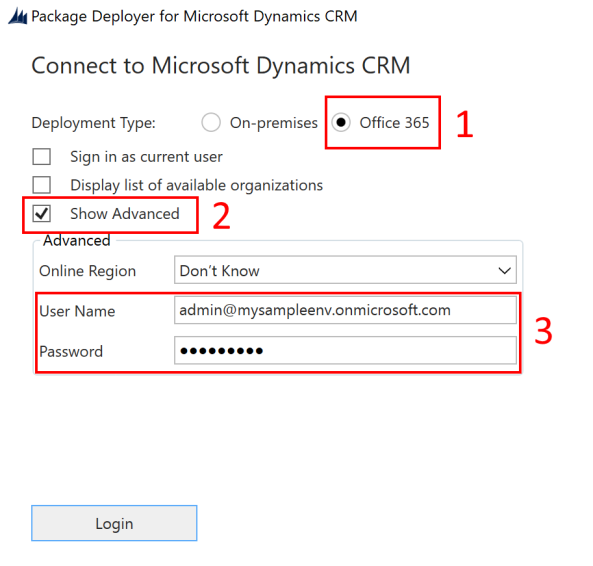
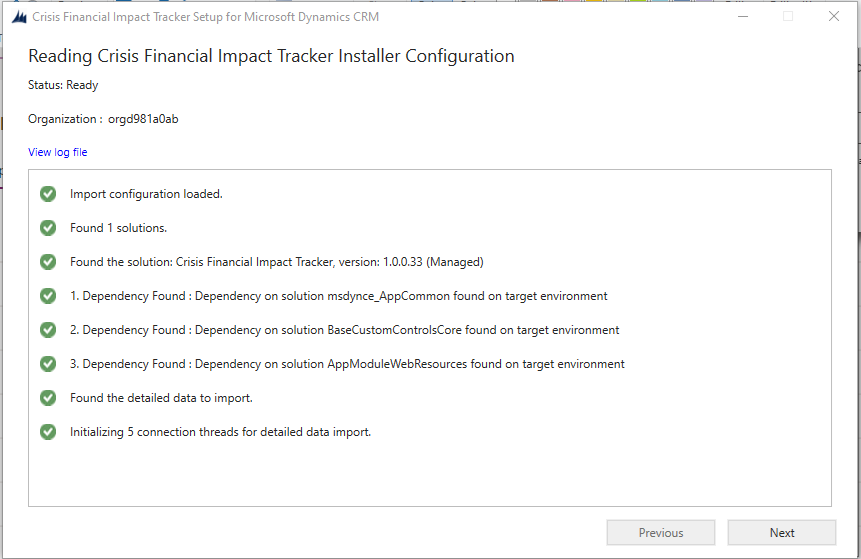
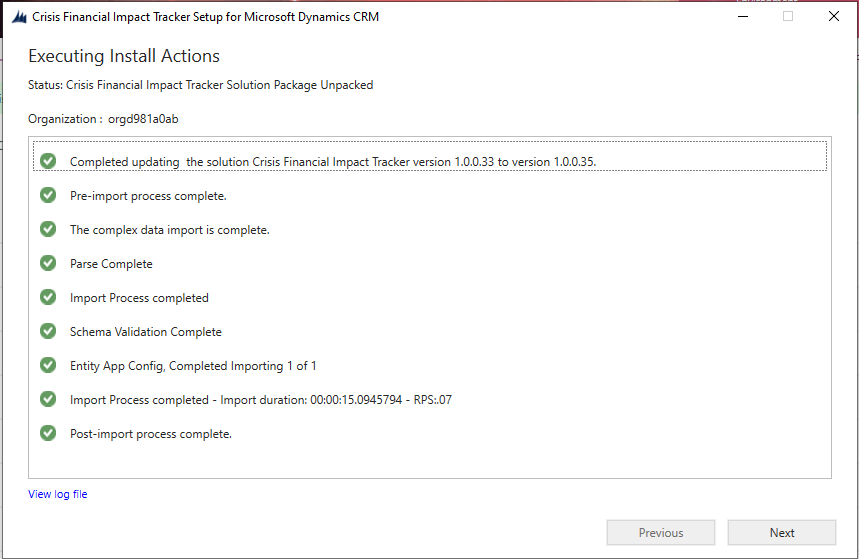
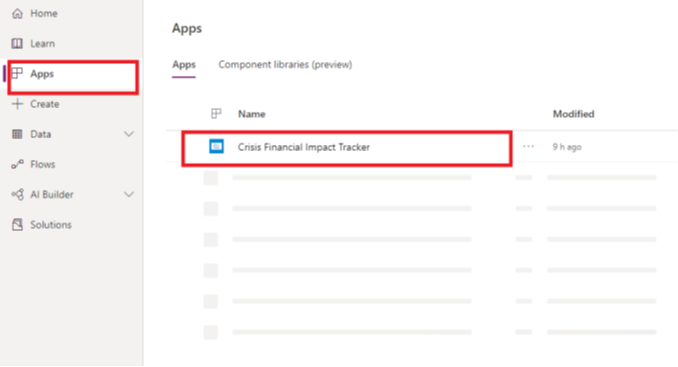
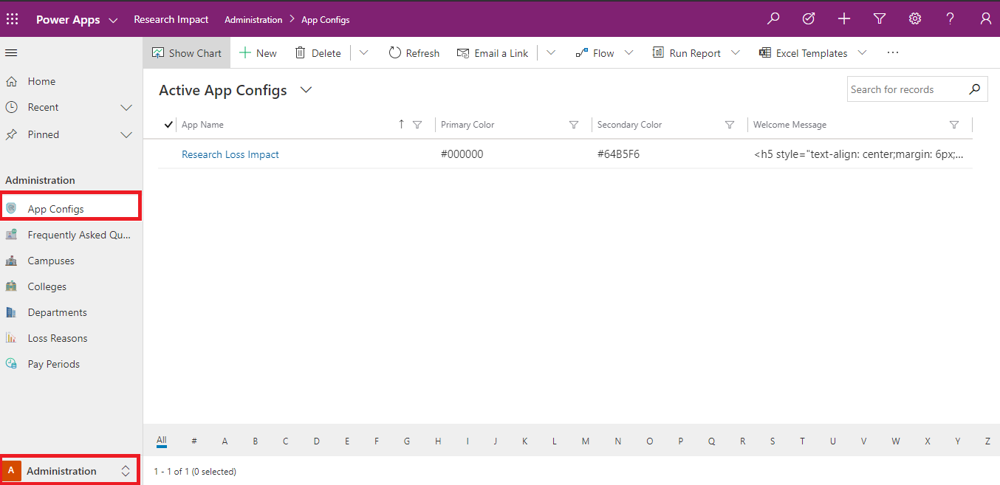

# Deployment

The Crisis Financial Impact Tracker app requires a small amount of setup to adapt to your needs. This article provides step-by-step instructions for the university IT admins to deploy and configure the application for their organization.

Estimated time to complete these steps: **30–35 minutes**.

## Step 1: Download the deployment package

Download the latest deployment package (.zip) from [here](https://github.com/microsoft/powerapps-tools/blob/master/Apps/CrisisFinancialImpactTracker/CrisisFinancialImpactTracker.zip).

Before extracting the .zip file, ensure that you unblock it.

1. Right-click on the .zip file and select **Properties**.

1. On the properties dialog box, select **Unblock**, and then select **Apply** followed by **OK**.

On extracting the .zip file, you will see the following in the extracted folder:

## Step 2: Sign up for Power Apps and create an environment

Sign up for [Power Apps](https://docs.microsoft.com/power-platform/admin/signup-for-powerapps-admin) if you don't have it already and purchase an appropriate license. More information: [Power Apps Pricing](https://powerapps.microsoft.com/pricing/)

After you have purchased Power Apps, create an environment with a Common Data Service database.

1. Sign in to [Power Platform admin center](https://aka.ms/ppac).

1. Create a Common Data Service environment with the database. More information: [Create and manage environments](https://docs.microsoft.com/power-platform/admin/create-environment)

    > [!IMPORTANT]
    >  While creating the database, if you select a security group for the database, remember that the apps can be shared *only* with users that are members of that security group.

1. Create users and assign appropriate security roles. More information: [Create users and assign security roles](https://docs.microsoft.com/power-platform/admin/create-users-assign-online-security-roles)

## Step 3: Install the app

Follow the steps below to install the Crisis Financial Impact Tracker app along with the configuration.

### Install the app from deployment package

1. Navigate to the folder where you have extracted the [deployment package (.zip)](https://docs.microsoft.com/powerapps/sample-apps/emergency-response/deploy-configure#step-1-download-the-deployment-package). You'll find a **Package** folder. Under the **Package** folder, run the **PackageDeployer.exe** file to run the tool to deploy the package.

1. On the next screen, select **Continue**.

1. You’ll be prompted to connect to your environment. Select **Office 365** as the **Deployment Type**, select **Show Advanced**, and then type your credentials to connect to your environment.

   > [!div class="mx-imgBorder"]
   > 

1. Select **Login** to continue.

1. If you have access to more than one Common Data Service environment, the next screen will prompt you to select the environment where you want to install the package. Select an environment and select **Login**.

    > [!div class="mx-imgBorder"]
    > 

1. On the next screen, select **Next.**

1. The next screen displays the environment name where the package will be installed. Review the information and select **Next**.

1. The next screen validates if the package can be installed on your environment. Select **Next** to continue with the installation.

   > [!div class="mx-imgBorder"]
   > 

1. The next screen displays the installation status of the package. After the installation is complete, select **Next**.

   > [!div class="mx-imgBorder"]
   > 

   > [!div class="mx-imgBorder"]
   > 

   > [!NOTE]
   >  It might take a while for the package installation to complete.

1. On the next screen, select **Finish** to complete and close the setup.

1. After the app is installed, navigate to [Power Apps](https://make.powerapps.com/), and select your environment from the top-right corner. You will see new apps under **Apps**:

   > [!div class="mx-imgBorder"]
   > 

The installation also adds the configuration data for the Crisis Financial Impact Tracker app.

Select the **Crisis Financial Impact Tracker App** to open the model-driven app that lets you configure the rest of the deployment settings. This app has several entities where you can add and manage data for your university system. You can use the area picker in the lower part of the left navigation pane to select a different area.

## Step 4: Update the app branding and tracking level

You can change the app icon, color scheme, or display name of the apps to
match the branding of your organization. You use **App Configs** entity in
the **Administration** area for these.

1. Open the admin App, and in the left navigation pane of the admin app, select **Administration** from the area picker, and then select **App Configs**. This shows all the records that you imported from the **AppConfig.xlsx** file.

   > [!div class="mx-imgBorder"]
   > 

1. Select the record.

    > [!div class="mx-imgBorder"]
    > 

1. On the app details page:

   - Double-click the app icon and select an icon file for the app from the **App
    Icons** folder. The image files are named intuitively so that you can easily select the correct icon. For example, select the `Crisis Financial Impact Tracker.png` file for **Crisis Financial Impact Tracker**. You can also select a custom image as per your organization branding.

   - If required, update the **App Name**.

   - If required, update the **Primary and secondary color** value of the app to set the display colors of the app in the app list.

   - If required, update the welcome message in HTML which you want your users to see on initial login.

   - Select **Save**.

## Step 5: Share canvas apps with the users in your organization

For your users to use and consume the data using the apps in their mobile devices, the apps must be shared with them. It's easier to use Azure AD groups
to easily share apps with groups of users.

1. Sign in to [Power Apps](https://make.powerapps.com/)

1. In the left navigation pane, select **Apps** to view a list of all your apps.

1. Select the app and select **Share**.

   > [!div class="mx-imgBorder"]
   > 

1. Specify the Azure AD group or users that you want to share this app with. As the app connects to Common Data Service data, you will also need to provide permissions to the entities. The sharing panel prompts you to manage
security for the entities. Assign the **Crisis Financial Impact Tracker User** and **Common Data Service User** security roles to the entities used by this app and select **Share**.

   > [!div class="mx-imgBorder"]
   > 

## Step 6: Share the model-driven app with admins in your organization

For admin users to use the admin app (model-driven app), it must be shared
with them. It's easier to use Azure AD groups to easily share apps with a group
of admin users.

1. Sign in to [Power Apps](https://make.powerapps.com/).

2. In the left navigation pane, select Apps to view a list of all your apps.

3. Select the model-driven app (**Crisis Financial Impact Tracker App**) and select **Share** on the banner.

4. Specify the Azure AD group or admin users that you want to share this app
with, assign the **Crisis Financial Impact Tracker App User** security role, and
select **Share**.
