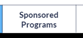

# Mobile App

In this unprecedented time, universities are struggling to understand the impact
of COVID-19, especially research centers. Research grants are one of the most
substantial sources of incoming revenue for universities. By reporting the
monetary implications, universities can assess and pursue their eligibility for
relief funding. The financial impact of COVID on the research grants and budgets
of these schools is in the millions.

<!-- Instead of genreic statement, this should be the purpose of using Mobile App-->

## Prerequisites 

To get started with the mobile app, you need to download the Power Apps Mobile
on your device using the device's app store.

-   **Download** the [Power Apps
    Mobile](https://powerapps.microsoft.com/downloads)

    -   For **Apple** devices with iOS such as iPhone and iPad, use [App
        store](https://aka.ms/powerappsios)

    -   For **Android** devices, use [Google
        Play](https://aka.ms/powerappsandroid)

-   Ensure your organization has deployed and configured the **Financial Impact
    Tracker** app, as explained in [Deploy](Deployment.md) and [configure](AdminConfiguration.md) the app.

After you install the Power Apps Mobile, open the app from your device and sign
in with your company's Azure Active Directory account. You can view all apps
shared with you by your organization once you sign in. For more information,
[see Power Apps mobile device sign
in](https://docs.microsoft.com/powerapps/user/run-app-client#open-power-apps-and-sign-in).

## Financial Impact Tracker Mobile App

Financial Impact tracker app allows users to review the sponsored programs they
are working on and report loss of effort because of pandemic or crisis. Open the
Financial impact tracker app from power Apps Mobile, review the welcome message
and click on "let's get started" to start using the app.

**Note:**

*When you launch the app first time, it will display the welcome message
configured in the admin app of the solution. As a user, you can choose to select
"don't show this message again," and the welcome message will not appear again.*

## App Components 

The Financial impact tracker app consists of following key components

-   [Grant](#grants)

    List of the grant the User is associated with as a Co-Principal
    Investigator. Users will be able to review the summary of grants and
    sponsored programs.

-   [Sponsored Programs](#sponsored-programs)

    List of Sponsored Programs the User is associated as a Co-Principal
    Investigator. Users will be able to review the sponsored program summary and
    report effort loss for each employee

-   [Employee](#employee)

    List of employees who are associated with sponsored programs in the
    sponsored program tab. Users will be able to review the summary of employee
    effort loss by pay period

### Sponsored Programs

Sponsored Program tab will allow users to review the list of sponsored programs
associated with the User as a co-principal investigator; You will be able to
**search** by entering any text in the search text.

Click on the **arrow icon** to view the details of the sponsored program

You can click on **Grants**

to view [Grant details](#grant-details) and click on **Employee**

to see [employee details](#employee-detail). You can also click on **Information
Icon**

to view [frequently asked questions](#frequently-asked-questions).

### Sponsored Program Details

Sponsored Program Detail form will allow you to review the summary of the
sponsored program and report the effort loss for each employee.

Select the **pay/reporting period**, enter the **loss percentage**, and select
**loss reason**. Now select the **employee(s)** you are reporting the effort
loss. Click **submit** to report the effort loss.

Select the **Back** from top-left if you want to go back to the sponsored
program list page without submitting any change . **Submit** button submits the
values you entered.

You can click on **Grants**

to view [Grant details](#grant-details) and click on **Employee**

to see [employee details](#employee-detail). You can also click on **Information
Icon**

to view [frequently asked questions](#frequently-asked-questions).

**Field and description**

| Field                         | Description                                                                                                                                |
|-------------------------------|--------------------------------------------------------------------------------------------------------------------------------------------|
| Co-Principal Investigator     | Name of the co-principal investigator                                                                                                      |
| Grant                         | Name of the grant this sponsored program is associated with. You can click on the name to view grant details                               |
| Sponsored Program Description | Description of the sponsored program                                                                                                       |
| Sponsor name                  | The name of the organization which is sponsoring the sponsored program                                                                     |
| Effort Loss Impact Amount     | Sum of the all the effort loss amount across multiple pay/reporting periods which is reported at this time                                 |
| Effort loss percentage        | This is the total effort loss in percentage as we compare to the total awarded amount. (Effort Loss Impact Amount )/ (Award Amount ) x 100 |
| Pay/Reporting Period          | Select Pay/ Reporting that is configured in the financial impact tracker admin app.                                                        |
| Loss Percentage               | Type loss percentage for the employee for selected pay/reporting period                                                                    |
| Loss Reason                   | Select the reason for the reported loss.                                                                                                   |
| Employee Check Box List       | List of employees who are working in the selected sponsored program                                                                        |

### Grants

**Grants** tab will allow users to review the list of **Grants** associated with
the User as a co-principal investigator;

Click on the **arrow icon** to view the details of the sponsored program

You can click on **Sponsored Programs**

to view [Sponsored Program details](#sponsored-program-details) and click on
**Employee**

to see [employee details](#employee-detail). You can also click on **Information
Icon**

to view [frequently asked questions](#frequently-asked-questions).

### Grant Details

**Grants Detail form** will allow you to review the summary of the **grants**
and **sponsored program** associated with the selected grant.

Select the **Back** from top-left if you want to go back to the **Grants list
page**

You can click on **Sponsored Programs**

to view [Sponsored Program details](#sponsored-program-details) and click on
**Employee**

to see [employee details](#employee-detail). You can also click on **Information
Icon**

to view [frequently asked questions](#frequently-asked-questions).

**Field and description**

| Field                     | Description                                                                                                                                |
|---------------------------|--------------------------------------------------------------------------------------------------------------------------------------------|
| Grant Title               | Title of the grant                                                                                                                         |
| Grant Number              | The unique number of the grant                                                                                                             |
| Principal Investigator    | Name of the principal investigator of the grant                                                                                            |
| Grant description         | The description of the grant                                                                                                               |
| Grant Status              | The status of the grant                                                                                                                    |
| Start Date                | Date when the grant was started                                                                                                            |
| End Date                  | Date when this grant is ending                                                                                                             |
| Sponsored Program List    | Lis of all the sponsored program that is associated with the grant and you as co-principal investigator                                    |
| Sponsor name              | The name of the organization which is sponsoring the sponsored program                                                                     |
| Co-Principal Investigator | Name of the co-principal investigator                                                                                                      |
| Effort Impact %           | This is the total effort loss in percentage as we compare to the total awarded amount. (Effort Loss Impact Amount )/ (Award Amount ) x 100 |
| Effort Impact (\$)        | Sum of the all the effort loss amount across multiple pay/reporting periods which is reported at this time                                 |
| Award Amount              | Amount award for the Sponsored Program                                                                                                     |
| Available Balance         | Available balance amount for the sponsored program.                                                                                        |

### Employee
--------

**Employee** tab will allow users to review the list of **Employees** associated
with the sponsored programs list in the **sponsored program tab**.

Click on the **arrow icon** to view the details of the **Employee**

You can click on **Sponsored Programs**

to view [Sponsored Program details](#sponsored-program-details) and click on
**Grant**

to see [Grant details](#grant-details). You can also click on **Information
Icon**

to view [frequently asked questions](#frequently-asked-questions).

### Employee Detail

**Employee detail form** will allow you to review the summary of the
**Employee** and **Effort impact** associated with the employee.

Select the **Back** from top-left if you want to go back to the **employee list
page**

You can click on **Sponsored Programs**

to view [Sponsored Program details](#sponsored-program-details) and click on
**Grant**

to see [Grant details](#grant-details). You can also click on **Information
Icon**

to view [frequently asked questions](#frequently-asked-questions).

**Field and description**

| Field                      | Description                                                                                                       |
|----------------------------|-------------------------------------------------------------------------------------------------------------------|
| Employment Class           | The classification of the employee                                                                                |
| Department                 | The department of the employee                                                                                    |
| Full name                  | The full name of the employee                                                                                     |
| College                    | The college of the employee                                                                                       |
| Annual Base Salary         | The annual base salary of the employee                                                                            |
| Effort Impact List         | Lis of all the sponsored program the employee is working and effort impact reported for each pay/reporting period |
| Reporting Period           | Pay / Reporting Period when the loss impact was reported                                                          |
| Sponsored Program          | The name of the sponsored program                                                                                 |
| Avg. Effort %              | The average effort of the employee associated with the sponsored program                                          |
| Amount (\$)                | Effort amount based on the average effort for the pay/reporting period                                            |
| Effort Impact %            | Effort impact reported for the pay/reporting period                                                               |
| Effort Impact (\$)         | Effort impact amount which was reported for the pay/reporting period                                              |
| Reason for the Effort Loss | The reason for the effort loss for the pay/reporting period                                                       |

### Frequently Asked Questions 

You can review frequently asked questions by clicking on

icon from any screen. These frequently asked questions are configured in the
financial impact tacker admin app based on your organization rules and
guidelines. If you need additional information, you will need to reach out to
your system administrator.

Select the **Back** from top-left if you want to go back to the **previous
page.**
