# Power BI Template

The Crisis Financial Impact Tracker is an App that is designed to collect data
pertaining to sponsored research programs, or projects.  More specifically,
the App enables researchers to submit the projected Lost Effort and Loss Reason
by grant, by employee, and by pay period.

By using Power BI service, you can analyze and visualize the data from the App.
This Power BI template pulls in the CDM data that is collected by the Crisis
Financial Impact Tracker.

These reports are intended to be used by Directors, Deans, and Research
Administrators who will monitor the data collected, on behalf of their
respective Departments, Sponsors, Colleges and/or Schools.

## Prerequisites

The Crisis Financial Impact Tracker uses Microsoft Power Apps that work on top of Common Data Service (CDS).

Data is pulled from the CDS into this Power BI template, which empowers you to securely store, integrate and automate the data for use with other business applications, including Power BI, Dynamics 365, Power Automate, and others.

To use this Power BI template, you need these prerequisites:

-   Download the free [Power BI
    Desktop](https://powerbi.microsoft.com/desktop/) app.

-   Sign up for the [Power BI
    service](https://powerbi.microsoft.com/get-started/).

-   Common Data Service environment with maker permissions to access the portal
    and read permissions to access data within entities.

To learn more about these topics:  
[What is Power BI
Desktop](https://docs.microsoft.com/en-us/power-bi/fundamentals/desktop-what-is-desktop)?  
[What is the Common Data
Service?](https://docs.microsoft.com/en-us/powerapps/maker/common-data-service/data-platform-intro)

### Option 1: Start with a Blank Report canvas

When you open the Power BI, you are greeted with a Power BI splash screen. You
may also be prompted to Sign In, to the Power BI service, using your work or
school account.

> 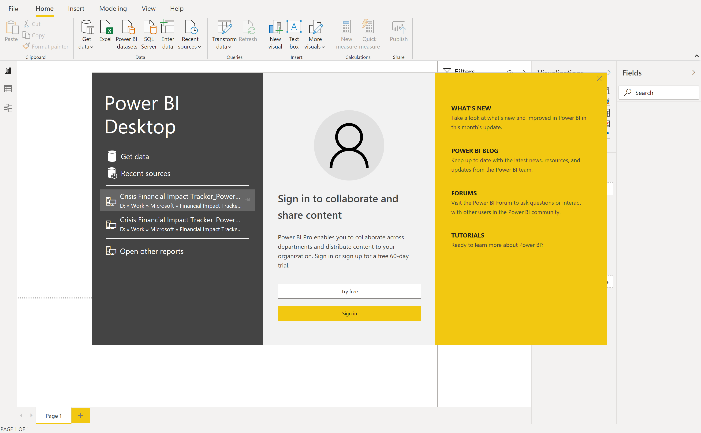

After signing in, click Get Data, and the select the Common Data Service (CDS) and Connect.
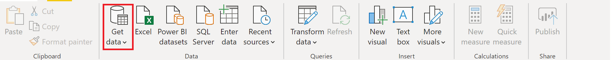

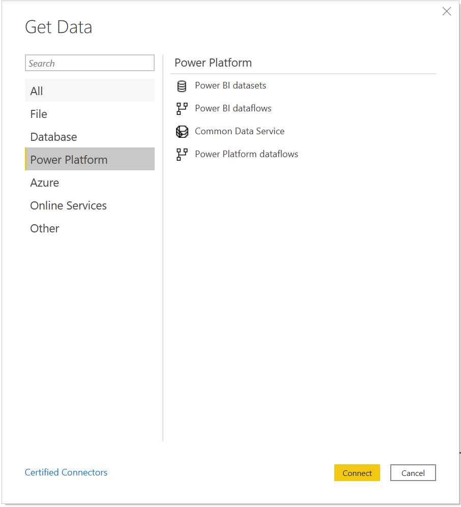

Enter the Server Url that is specific to your CDS environment and access.

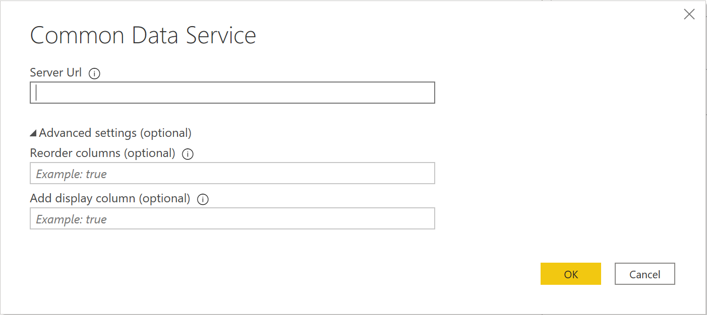

Finding your Common Data Service Environment URL

-   Open [Power
    Apps](https://make.powerapps.com/?utm_source=padocs&utm_medium=linkinadoc&utm_campaign=referralsfromdoc),
    select the environment you're going to connect to, select **Settings** in
    the top-right corner, and then select **Advanced settings**.

-   In the new browser tab that opens, *copy the root of the URL*. This is the
    unique URL for your environment. The URL will be in the format of
    <https://yourenvironmentid.crm.dynamics.com/>. Make sure not to copy the
    rest of the URL. Keep this somewhere handy so you can use it when creating
    your Power BI reports.

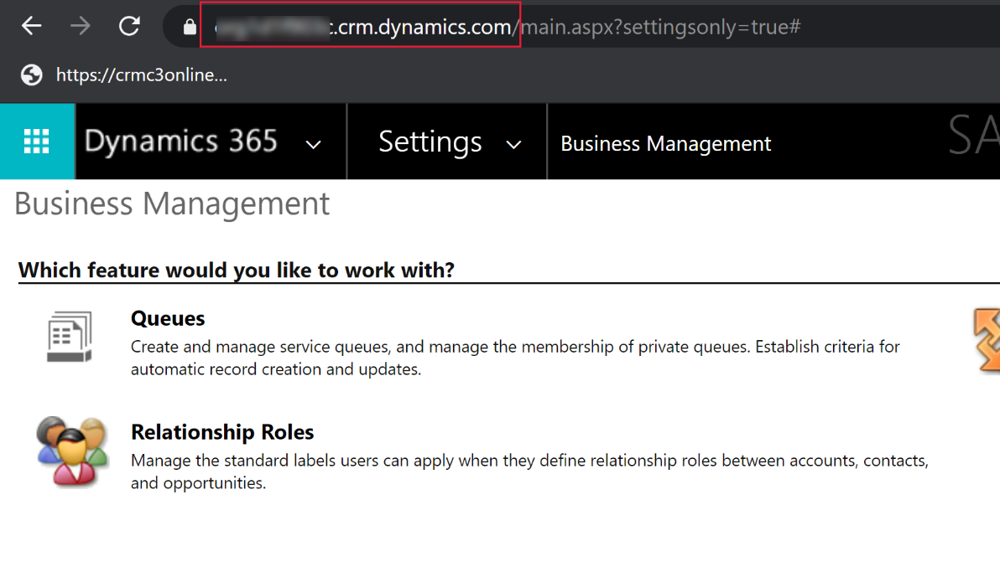

After connecting successfully, the Navigator will open and folders for Entities and System will be available. Expand Entities.

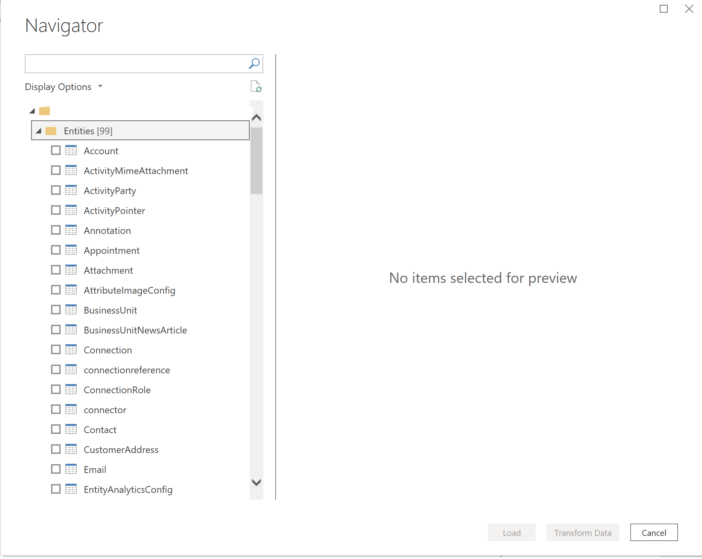
----------------------------------------

Select the following tables from the list of Entities (check the boxes):

-   Account

-   Contact

-   msft_Campus

-   msft_College

-   msft_Department

-   msft_EmployeeCompensation

-   msft_Grant

-   msft_LossReason

-   msft_PayPeriod

-   msft_SponsoredProgram

To learn more about these topics:

[Types of entities](https://docs.microsoft.com/en-us/powerapps/maker/common-data-service/types-of-entities) [Create a relationship between entities](https://docs.microsoft.com/en-us/powerapps/maker/common-data-service/data-platform-entity-lookup)

After selecting these tables, Transform Data. The Power Query Editor window will open, with the selected tables and data loaded.

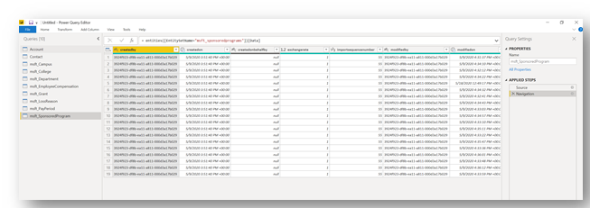
----------------------------------------

For each Entity table in the CDS, click Choose Columns within the ribbon to open
the console and select which fields to use in the data model and reports.

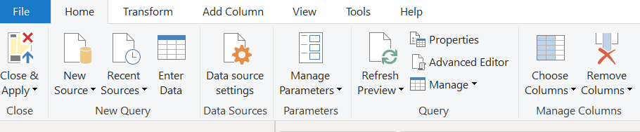

Here are suggested fields for each Entity:

- Contact

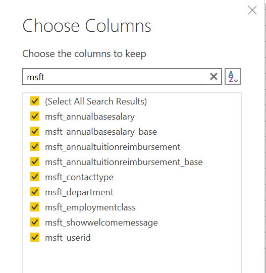

- msft_Campus

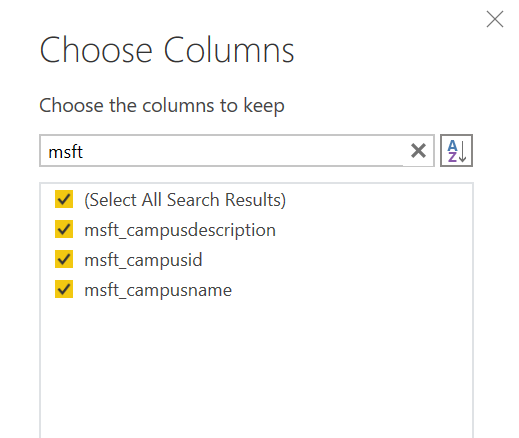

- msft_College

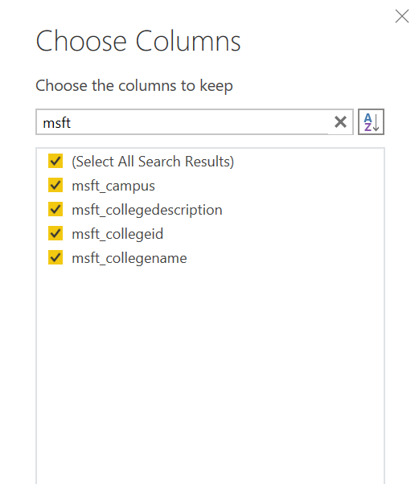

- msft_Department

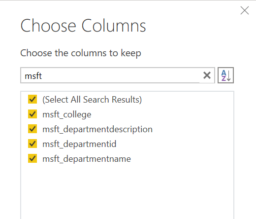

- msft_EmployeeCompensation

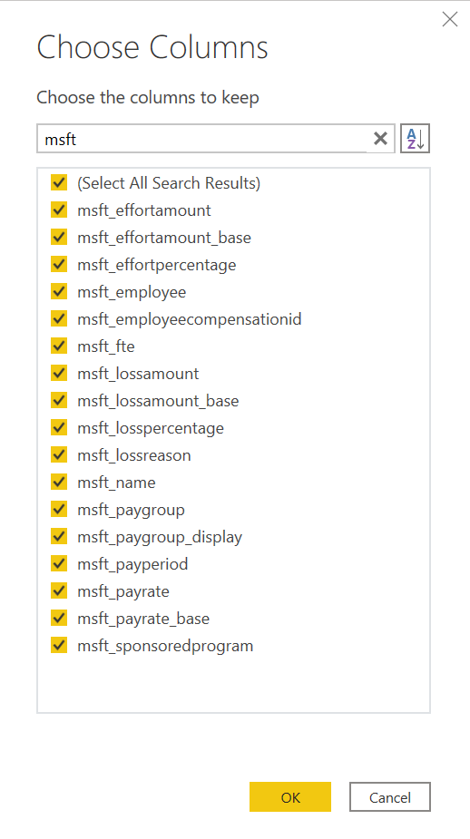

- msft_Grant

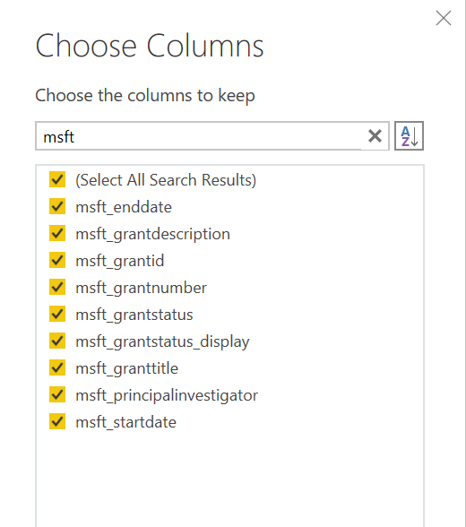

- msft_LossReason

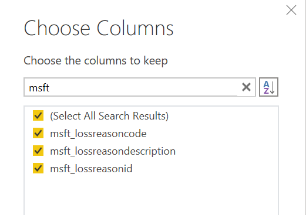

- msft_PayPeriod

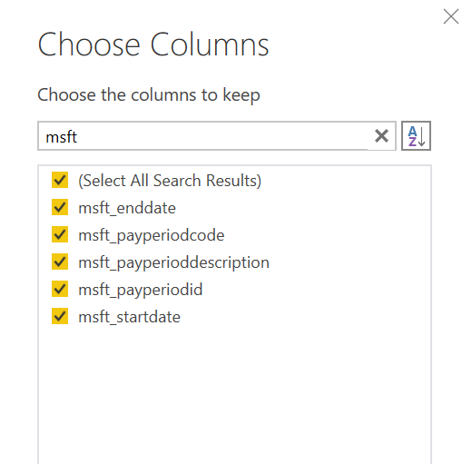

- msft_SponsoredProgram

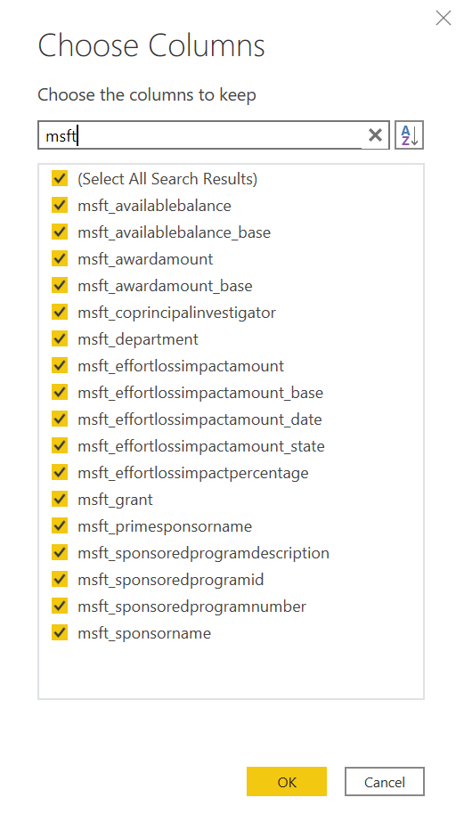

Click Close & Apply to close the Power Query Editor and apply the changes made.

You will see the following message pop up within the Power BI report canvas. It may take several minutes for the queries to run. 

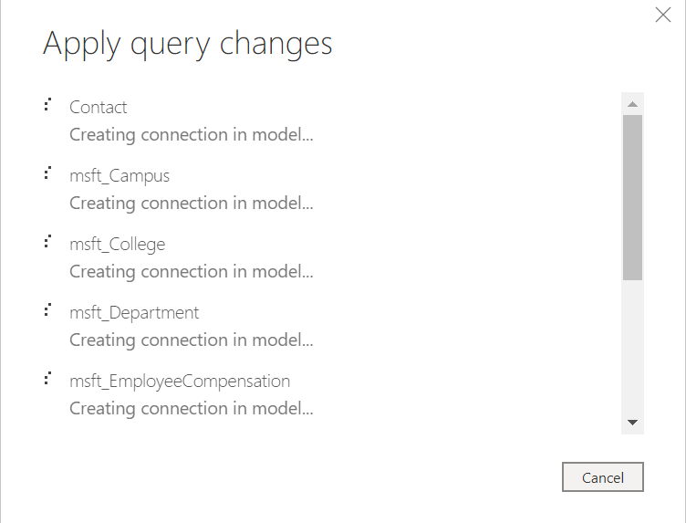

After the changes are applied, the report canvas within Power BI will look
similar to this, including the tables listed within the Fields panel on the
right side of the page.

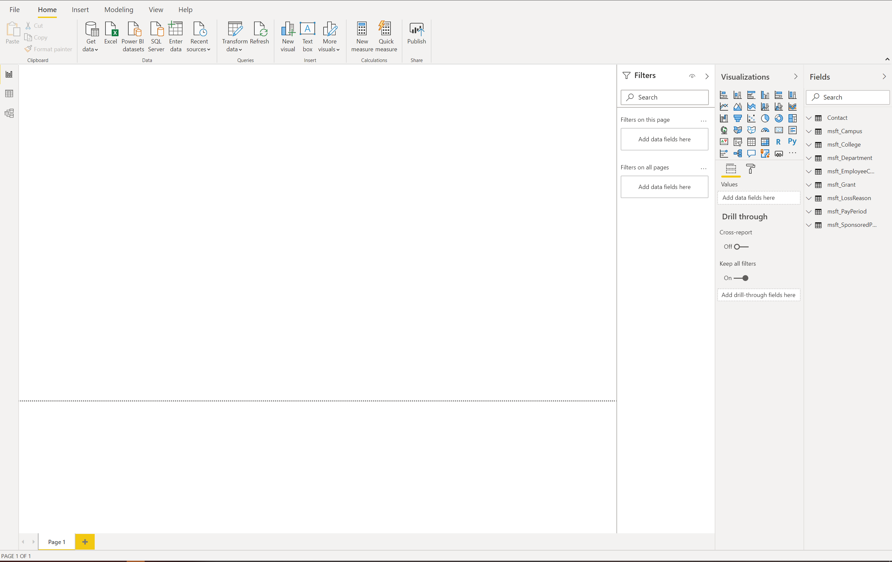

Click the icon on the left side of the page to open the Model view. You will see
the tables that you selected. Use the slider in the bottom right to adjust the
view size.

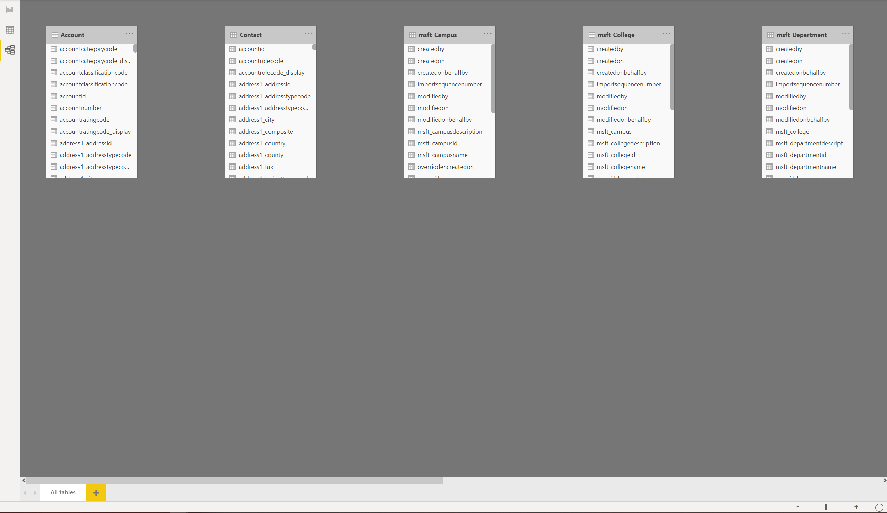

In the Home tab of the ribbon within Power BI, click Manage Relationships to
open the console, where you will create new relationships between the entities.

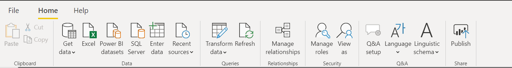

When creating or editing a relationship between entities, select the tables and
the columns to be joined, as well as the cardinality and cross-filter direction
for the relationship.

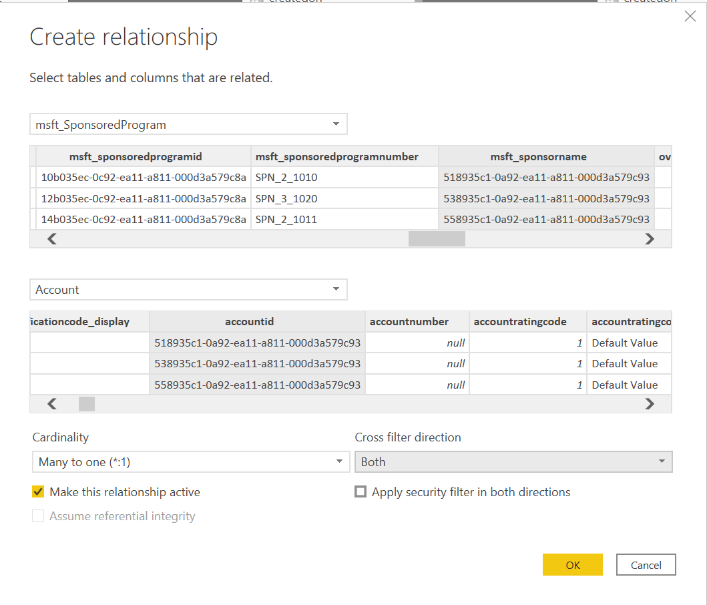

To use the suggested fields within the CDS that are pertinent to the Power BI
template, your relationship mapping between tables should look like this:

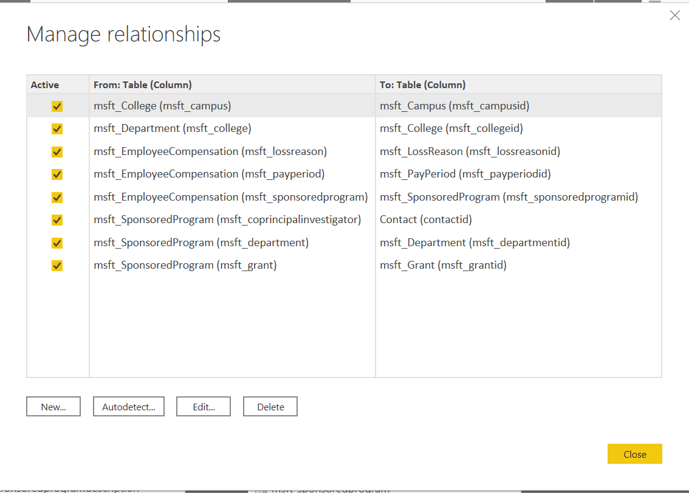

Here is a screenshot of the Entity Relationship Diagram, within the Model view:

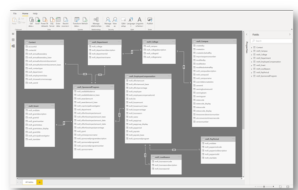

## Option 2: Download the Power BI template

The Power BI file contains sample data and interactive graphics in a .pbix file
format you can further edit and update in Power BI Desktop.

Click [here](https://github.com/microsoft/powerapps-tools/blob/master/Apps/CrisisFinancialImpactTracker/PBITemplate.pbix) to download the Power BI (.pbix) file.

### Open the Power BI template

When you open the Power BI, you are greeted with a Power BI splash screen. You
may also be prompted to Sign In, to the Power BI service, using your work or
school account.

Once the report opened, the first page provides Microsoft’s Legal Disclaimer.

### Home Page

Click the Home button, or tab at the bottom of the workbook, to go to the Home
page.

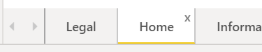

The Home Page of the Power BI template includes sample text which can be
utilized and modified according to preference.

All pages within the Power BI template include the following buttons:

-   The sidebar includes **Back**, **Home**, **Information**, and **FAQ**
    buttons

    -   the sidebar includes four (4) buttons organized in a Group.

-   **Submissions** launches the Submissions Report page

-   **Sponsors** launches the Impact by Sponsor Report page

-   **Department** launches the Department View

To learn more on these topics:  
[Use buttons in Power
BI](https://docs.microsoft.com/en-us/power-bi/create-reports/desktop-buttons)  
[Group visuals in Power BI Desktop
reports](https://docs.microsoft.com/en-us/power-bi/create-reports/desktop-grouping-visuals)

An institution may add their Logo to all pages within the template, by inserting
an Image to the page, and then copying it to the other pages.

To learn more on this topic:  
[Copy and paste a report
visualization.](https://docs.microsoft.com/en-us/power-bi/visuals/power-bi-visualization-copy-paste)

## Connect to the Common Data Service

In order to utilize your own data, collected by the Crisis Financial Impact
Tracker, you will need to update the data connection within the template.

To learn more about this topic:  
[Create a Power BI report using the Common Data Services
connector](https://docs.microsoft.com/en-us/powerapps/maker/common-data-service/data-platform-powerbi-connector)

To change the Data Source, click Transform data to open the Power Query Editor.
Within the Applied Steps of the Query Editor, change the Source for each Entity.
Use the CDS environment URL for your organization.

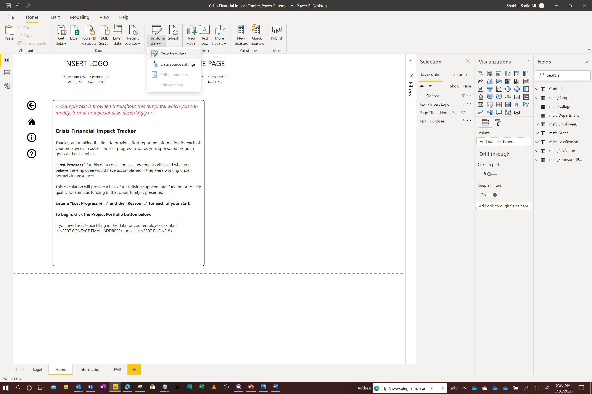

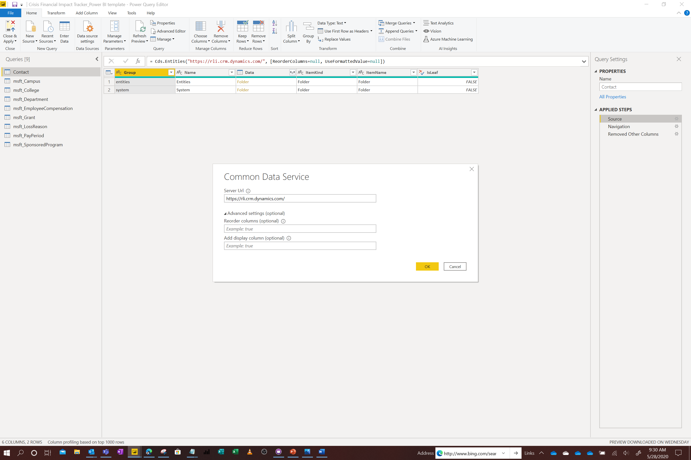

## Finding your Common Data Service Environment URL

-   Open [Power
    Apps](https://make.powerapps.com/?utm_source=padocs&utm_medium=linkinadoc&utm_campaign=referralsfromdoc),
    select the environment you're going to connect to, select **Settings** in
    the top-right corner, and then select **Advanced settings**.

-   In the new browser tab that opens, *copy the root of the URL*. This is the
    unique URL for your environment. The URL will be in the format of
    <https://yourenvironmentid.crm.dynamics.com/>. Make sure not to copy the
    rest of the URL. Keep this somewhere handy so you can use it when creating
    your Power BI reports.

### Submissions

Click the Submissions tab at the bottom of the workbook, to go to the Home page.

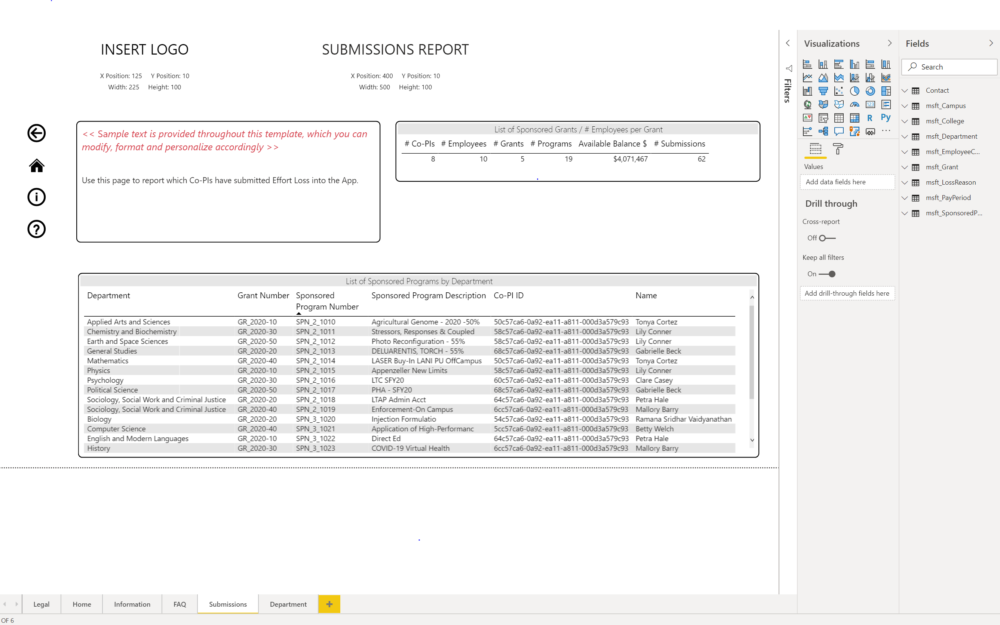

### Department View

Click the Home button, or tab at the bottom of the workbook, to go to the Home
page.

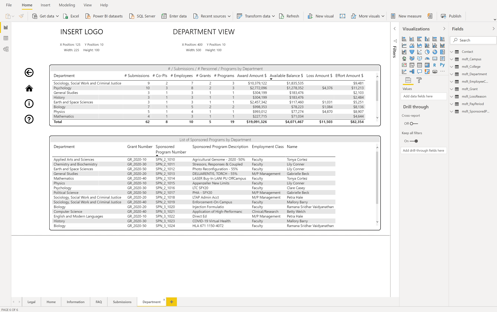

## Disclaimers

This report and data are provided "as is", "with all faults", and without
warranty of any kind. Microsoft gives no express warranties or guarantees and
expressly disclaims all implied warranties, including merchantability, fitness
for a particular purpose, and non-infringement.
