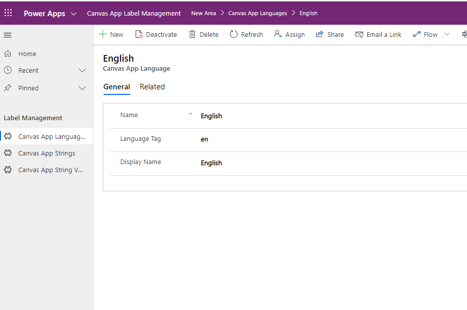
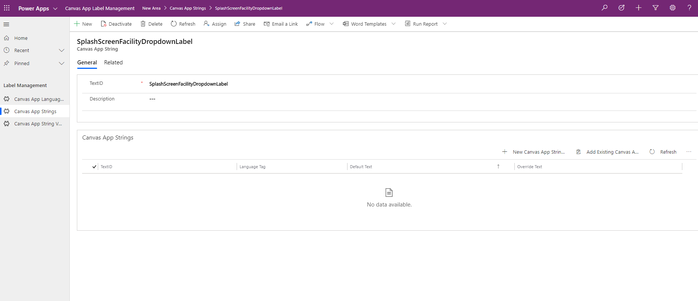
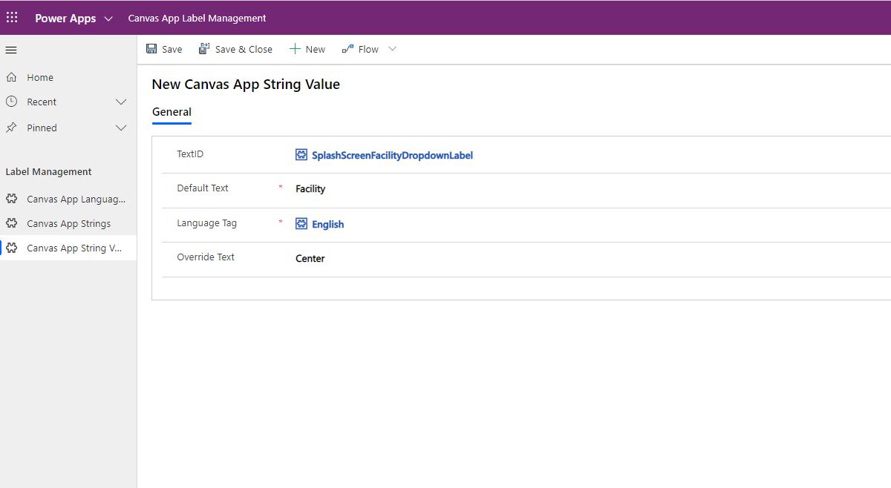
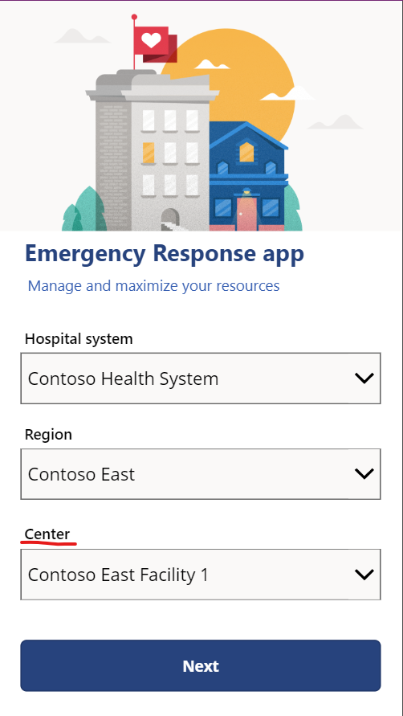
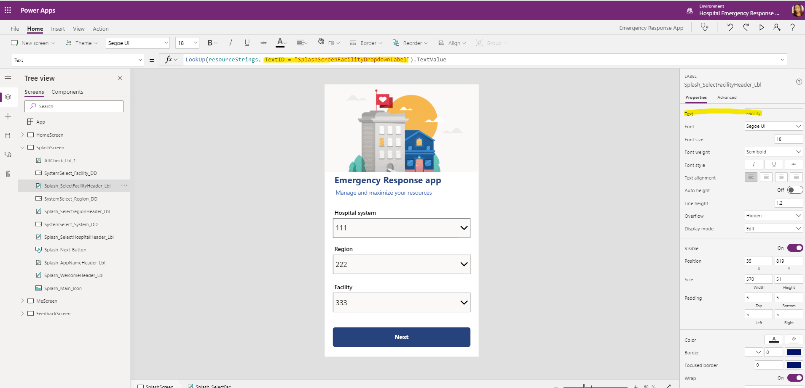

# Extend Hospital Emergency Response mobile app labels (Experimental)

[This topic is pre-release documentation and is subject to change.]

You can extend Hospital Emergency Response mobile app labels with custom text. To do this, you have to import the **Canvas Apps Strings** solution. The solution adds model-driven app named **Canvas App Label Management** that you can use to customize the Hospital Emergency Response mobile app labels. Add new languages supported by the solution and text for corresponding mobile app labels using the model-driven app.

> [!IMPORTANT]
> This feature is experimental. For more information about experimental features, see [Understand experimental and preview features in Power Apps](https://docs.microsoft.com/powerapps/maker/canvas-apps/working-with-experimental-preview).

## Prerequisites

- You must have [Hospital Emergency Response - Power Platform sample solution](docs.microsoft.com/powerapps/sample-apps/emergency-response/overview) already deployed.
- Before you deploy the solution, take a note of the current live version of your canvas apps for Hospital Emergency Response solution. For more details, go to [Uninstalling the Canvas App Strings solution](#uninstalling-the-canvas-app-strings-solution).

## Import the Canvas App Strings solution

Download the **Canvas App Strings** solution and import to your environment. For instructions on how to import solution, read [Import a solution](https://docs.microsoft.com/powerapps/maker/model-driven-apps/distribute-model-driven-app#import-a-solution).

The **Canvas App Strings** solution contains:

- Canvas app string entities.
- Model-driven app to manage strings.
- Updated set of canvas apps.

## Working with the Canvas App Label Management app

Canvas App Label Management app is a model-driven app imported when you import the **Canvas App Strings** solution. You can create and edit strings across different languages for use in the Hospital Emergency Response mobile app.

### Add new language record

Create a new language record for labels in mobile app. After you add the language record, you can add custom labels for Hospital Emergency Response mobile app.

1. Sign in to [Power Apps](https://make.powerapps.com).
1. Select **Apps** from the left navigation pane.
1. Select the **Canvas App Label Management** app to open.
1. Select **Canvas App Languages** from the left navigation pane.
1. Select **New**.
1. Enter values for Name, Language Tag and Display Name. For example, 'English' as the name and display name, with 'En' as the language tag.

    

1. Select **Save**.

### Add new string record

1. Select **Canvas App Strings** from the left navigation pane.
1. Select **New**.
1. Enter TextID and Description. For example, *SplashScreenFacilityDropdownLabel* and *Facility selection on splash screen*.

    

    > [!NOTE]
    > To find TextID in Hospital Emergency Response mobile app, go to [Find TextID of a label](#find-the-textid-value-of-the-label).

1. Select **Save**.

### Add your canvas app label

1. Select **Canvas App String Values** from the left navigation pane.
1. Select **New**.
1. Select TextID, for example *SplashScreenFacilityDropdownLabel*.
1. Enter Default Text, for example *Facility*.
1. Select Language Tag, for example *English*.
1. Enter Override Text, for example *Center*.

    > [!NOTE]
    > **Override Text** is the new label value to be displayed in your Hospital Emergency Response mobile app.

    

1. Select **Save**.

You can also follow the steps to add your canvas app label using the sub-grid on the **Canvas App Strings** record.

### View your changes

Play the app to view your changes using your mobile device.

To play the app in browser:

1. Sign in to [Power Apps](https://make.powerapps.com).
1. Select **Apps** from the left navigation pane.
1. Select the canvas app to play.

## Find the TextID value of the label

1. Sign in to [Power Apps](https://make.powerapps.com).
1. Select **Apps** from the left navigation pane.
1. Select the canvas app.
1. Select **Edit** from top menu.
1. Select the label that you want to customize text for.
1. From the property list on top left, select the **Text** property.

    

The **Text** property formula bar on top shows the **TextID**. And the **Text** property on the right side property pane shows the **Default Text** value.

## Uninstalling the Canvas App Strings solution

If you uninstall Canvas App Strings solution, the apps will continue to run, even though the entity that the app is looking for doesn't exist.

You can restore canvas apps to previous version that didn't use Canvas App Strings solution in two different ways:

1. Note the current live version of the app before you import the solution. You can restore the app to this version after you uninstall the solution. For more information: [Restore a canvas app to a previous version in Power Apps](https://docs.microsoft.com/powerapps/maker/canvas-apps/restore-an-app).

1. Create a new solution and the existing apps. Export the solution as backup. If you uninstall the Canvas App Strings solution, you can import your backup solution with default apps. To learn how to add apps to solution and export, go to [Link an existing canvas app to a solution](https://docs.microsoft.com/powerapps/maker/canvas-apps/add-app-solution#link-an-existing-canvas-app-to-a-solution).

## Considerations

- Some TextIDs (labels) can be found in the **OnVisible** property of a screen as a part of a collection.
- HomeScreen, SplashScreen, FeedbackScreen, MeScreen, Buttons and the timestamp for last submitted data share the same TextIDs across apps. Other screens use separate values for TextIDs, even if the Default Text is same across apps; for example *Location*.
- Canvas App Strings solution supports the following languages: German, Spanish, French, Italian, Japanese,  Korean, Polish, Portuguese (Portugal), Portuguese (Brazil), and Turkish.
