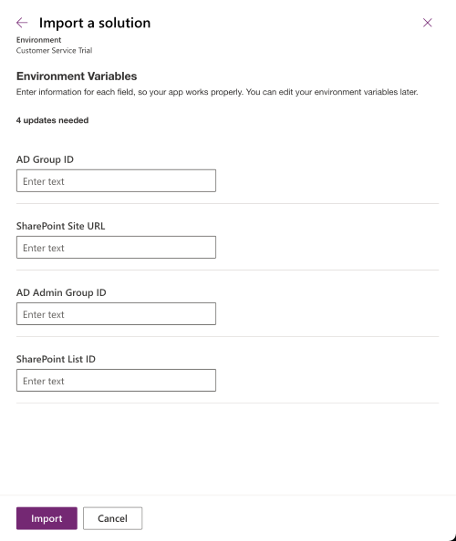
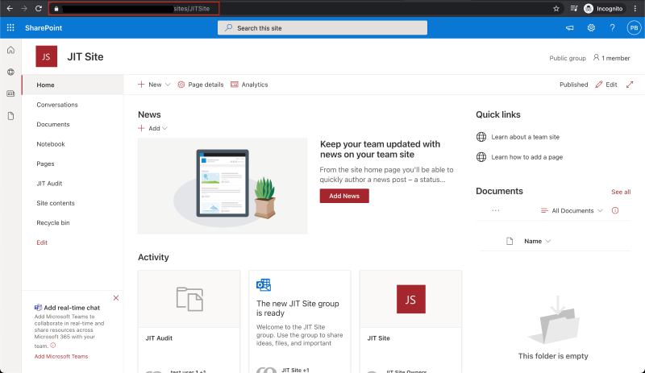
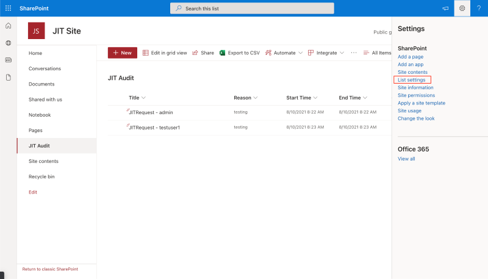
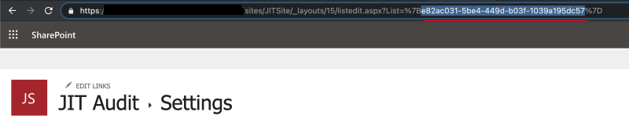
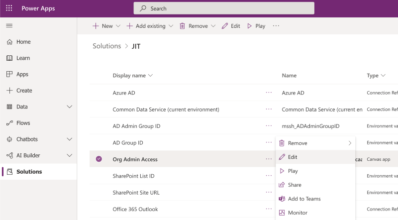
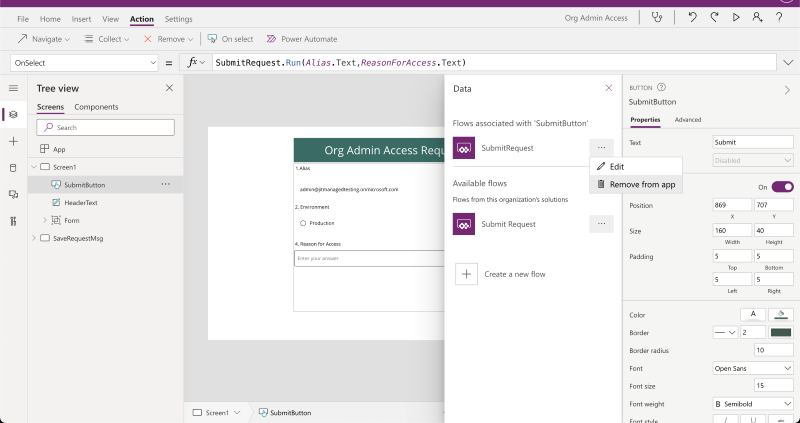
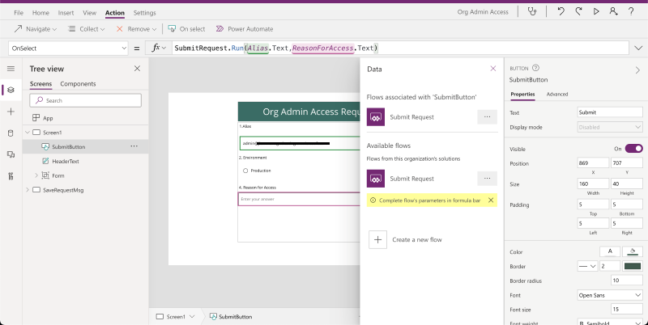

# Intro

This is a supporting document for the blog we published [here](https://powerapps.microsoft.com/). The below components need to be configured for the solution to work successfully.

Note

- Please remember to share the canvas app with the users expected to gain elevated permissions
- If you are setting up a new SharePoint site, please use a 'Team' site
- When importing the solution, do use the new import experience which will allow you to set connection references and environment variables during import itself.
- These flows will need to be configured from a permanent admin account so they can grant elevated permissions.

## Azure Groups Setup

Two Active Directory Group in Azure (portal.azure.com) need to be created and group ids provided in the environment variables. They are:

- Azure JIT users - This group contains the users allowed for JIT access and get elevated roles.

- Azure Admin users - Users in this group have permanent admin roles.
    Typically consists of service accounts.

Copy the Object ID of the AD group (JIT Users) to set in the "AD Group ID" envrionment variable during the solution import.

Copy the Object ID of the AD group (JIT Admin Users) to set in the "AD Admin Group ID" envrionment variable during the solution import.

## SharePoint Site/List Setup

- Create a SharePoint site, if you don't have one already and then
    create a list in the site as mentioned below.

- Sample:

  - Site Name - JIT Site

    - List Type - Blank List

    - Name - JIT Audit

    - Columns -

      - Add Reason (Multiple lines of text)

      - Start Time (Date and time). Set "Include Time" = Yes.

      - End Time (Date and time). Set "Include Time" = Yes.

## Solution Configuration

### Connections

The below 4 connections should be used/created once the solution is
imported.

- Azure AD

- Microsoft Dataverse

- SharePoint

- Office 365 Outlook

### Environment Variables

The below 4 environment variables values should be provided once the solution is imported.

- AD Group ID – the Object ID of the Azure JIT Users AD group

- SharePoint Site URL

- AD Admin Group ID – the Object ID of the Azure Admin users AD group

- SharePoint List ID

To get the SharePoint Site URL go to SharePoint Site home page and copy the URL.

To get the SharePoint List ID go to the created SharePoint List page, click on the "Settings" button in the top right corner of the page and navigate to List Settings. Then copy SharePoint List ID from the URL (ignore "%7B" and "%7D" parenthesis around the guid).

## Troubleshooting

If after completion of all steps above users cannot submit the request, perform the steps below to troubleshoot the issue.

- Navigate to the "Org Admin Access" canvas app in the edit mode.

- Click on the "Submit" button, select Action in the top menu and go to the "Power Automate" section.
- Copy OnSelect function value to paste it back after re-adding the flow.

- Remove "SubmitRequest" flow from the canvas app.

- Add "SubmitRequest" flow back to the canvas app by selecting it in the "Available Flow" section.

- Paste OnSelect function value copied earlier back in the formula bar.
- Save and publish canvas app.

## Support
Please do not open a support ticket if you encounter any bugs with the solution itself, unless it is related to an underlying platform issue unrelated to the template's implementation. If there are issues related to the solution implementation itself, please [report bugs here](https://github.com/microsoft/powerapps-tools/issues/new?assignees=ankitchawla23&labels=jitaccess&template=-jit-access--bug-report.md&title=).

### Disclaimer
*This app is a sample and may be used with Microsoft Power Apps and Teams for dissemination of reference information only. This app is not intended or made available for use as a medical device, clinical support, diagnostic tool, or other technology intended to be used in the diagnosis, cure, mitigation, treatment, or prevention of disease or other conditions, and no license or right is granted by Microsoft to use this app for such purposes. This app is not designed or intended to be a substitute for professional medical advice, diagnosis, treatment, or judgement and should not be used as such. Customer bears the sole risk and responsibility for any use of this app. Microsoft does not warrant that the app or any materials provided in connection therewith will be sufficient for any medical purposes or meet the health or medical requirements of any person.*
