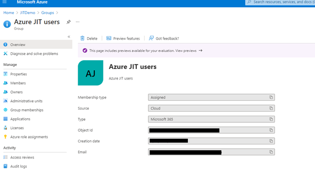
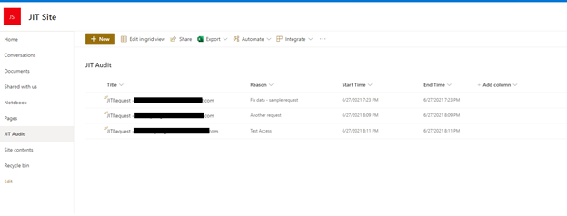
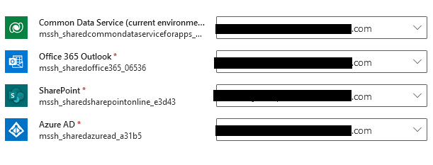
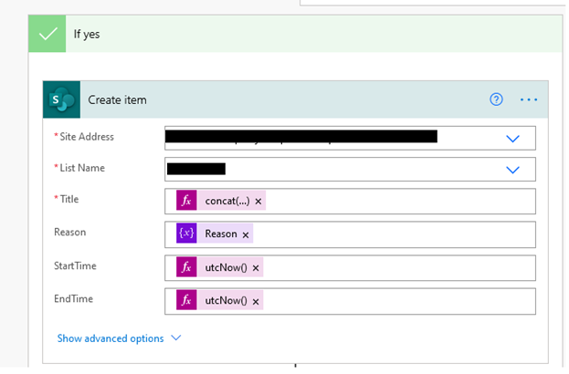
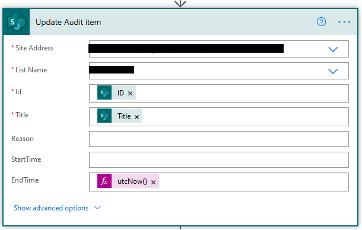
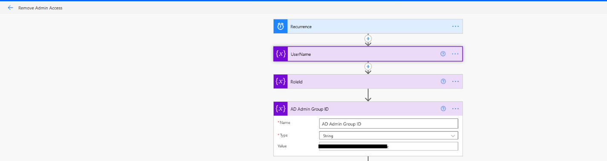
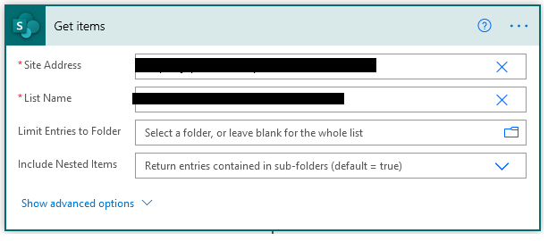

# Intro

The below components need to be configured for the solution to work successfully.

Note

- Please remember to share the canvas app with the users expected to gain elevated permissions
- If you are setting up a new SharePoint site, please use a 'Team' site
- When importing the solution, do use the new import experience which will allow you to set connection references during import itself

## Azure Groups Setup

Two Active Directory Group in Azure (portal.azure.com need to be created and group ids provided in the flows. They are:

- Azure JIT users - This group contains the users allowed for JIT access and get elevated roles.

- Azure Admin users - Users in this group have permanent admin roles.
    Typically consists of service accounts.

Copy the Object ID of the AD group (JIT Users) to set in the "Submit
Request" flow variable (AD Group ID).

Copy the Object ID of the AD group (JIT Admin Users) to set in the
"Submit Request" and "Remove Admin Access" flows variable (AD Admin
Group ID).

## SharePoint Site/List Setup

- Create a SharePoint site, if you don't have one already and then
    create a list in the site as mentioned below.

- Sample:

  - Site Name - JIT Site

    - List Type - Blank List

    - Name - JIT Audit

    - Columns -

      - Add Reason (Multiple lines of text)

      - Start Time (Date and time). Set "Include Time" = Yes.

      - End Time (Date and time). Set "Include Time" = Yes.

## Flow Configuration

### Connections

The below 4 connections should be used/created once the solution is
imported.

- Azure AD

- Microsoft Dataverse

- SharePoint

- Office 365 Outlook

### Submit Request Flow Configuration

After the solution is imported, perform the below steps:

- Edit the flow to set the AD Group ID (Active Directory Group ID) and
    AD Admin Group ID as below:

- Set the SharePoint Site Name and List in "Create Item" and "Update
    Audit Item" SharePoint actions in the flow as shown below:

- Enable the flow.

### Remove Admin Access Flow Configuration

- Edit the flow to set the AD Admin Group ID (Active Directory Admin
    Group ID) as below:

- Set the share point site address and list name in "Get items" step
    in the flow:

- Enable the flow.
