# Deployment

Follow the steps given in this document to install the Release Planner App in your environment.

### Step by step instruction

1.  On the environment where you intend to import the solution go to
    “Solutions”.  
    #### Classic UI
    

    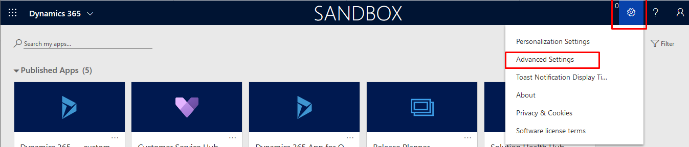

    

    #### Modern UI
    

    

2.  Select “Import” on the toolbar.  
    #### Classic UI
    

    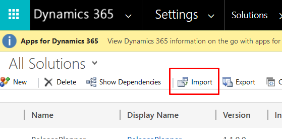

  
   #### Modern UI  
   
   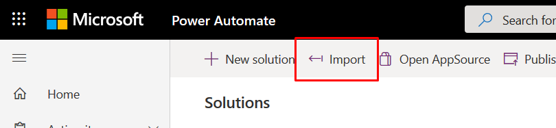

3.  Select the solution package ZIP file you have downloaded on step 1 and click
    “Next”:  
    

    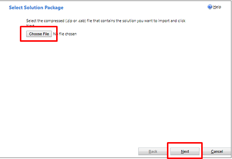

4.  Click “Next”:  
    

    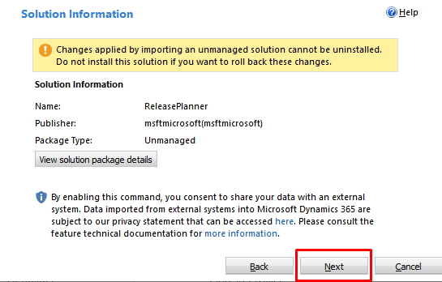

5.  After the import has completed, click “Publish All Customizations”:  
    

    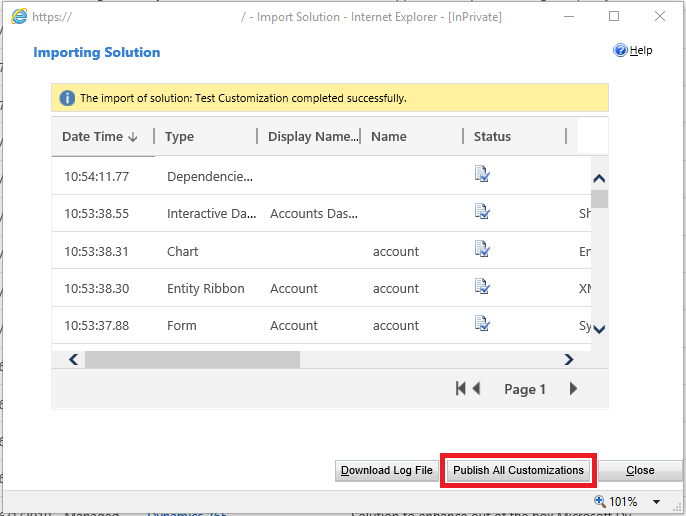

### Post-deployment steps

#### Configure “Generate Release Plans Word Document” flow

This flow should be configured if you are looking to generate the Word Document
from the release planner app that contains all the features for a particular
release wave and particular application.

1.  On the environment where you have imported the solution go to “Solutions”
    using the Modern UI:  
    

    

2.  Select “Release Planner” solution:  
    

    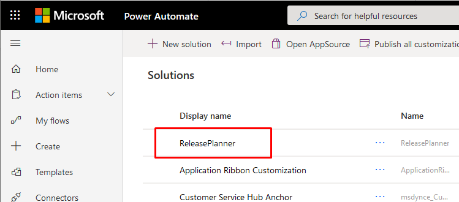

3.  Select “Flow” filter on the upper right:  
    

    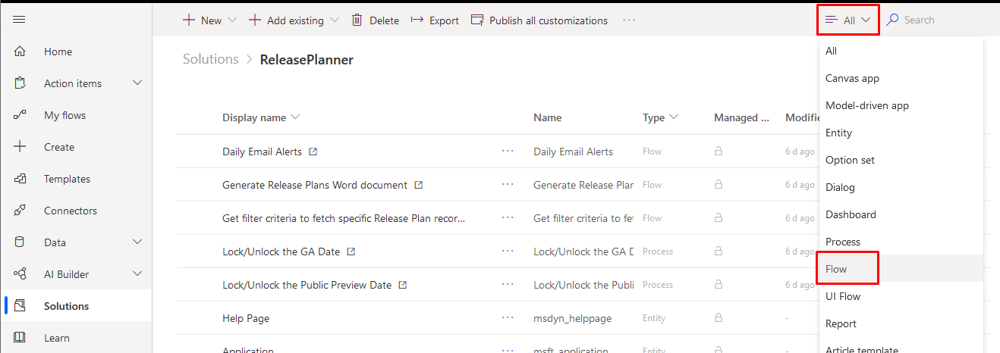

4.  Select “Get Filter Criteria to fetch specific Release Plan records”:  
    

    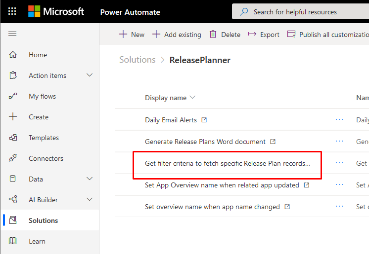

5.  Select “Edit”:  
    

    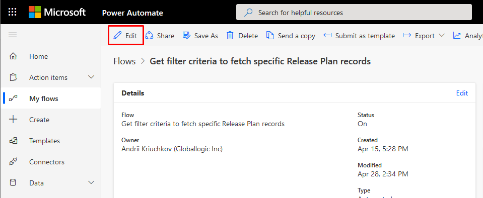

6.  Expand “When an HTTP request is received” step and copy its URL to the
    clipboard:  
    
    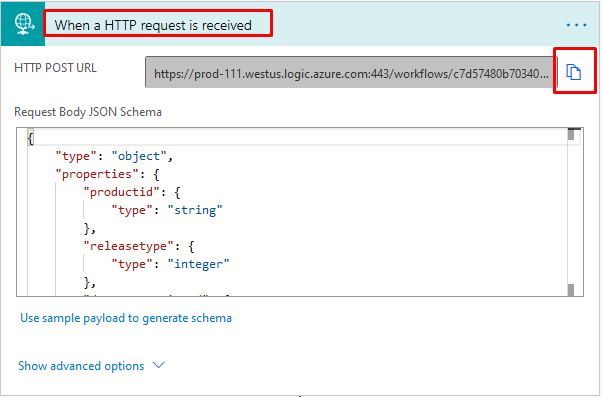
    
     > [!NOTE]
     > The Flow should be turned on for the URL to get generated.

7.  Go back to the list of flows and select “Generate Release Plans Word
    document”:  
    

    

8.  Scroll down to “For each application” step:  
    

    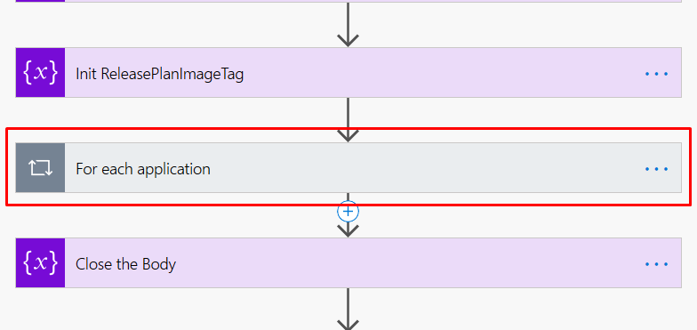

9.  Expand “For each application”, expand “Hierarchy Product value is not null”,
    scroll down to “Get Filter Criteria” step and expand it:  
    

    

10. Paste the URL copied on step 1.6 into “URI” field.

11. Scroll up to “Init FilePath” step and expand it. In the “Value” field enter
    the path to the SharePoint folder, where the resulting .doc files will be
    saved:  
    

    

12. Copy “HTML.htm” template file (supplied with the Release Planner solution)
    to the SharePoint folder you specified on step 1.11.

13. Scroll down to “Initialize SharePoint SiteAddress” step and expand it. Enter
    your SharePoint site address into “Value” field:  
    

    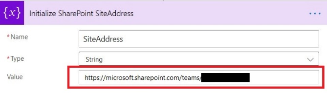

14. Scroll to the very beginning of the flow. Expand the first “When a HTTP
    request is received” step and copy its URL to the clipboard:  
    

    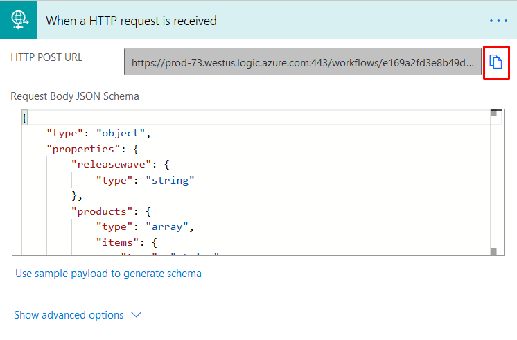

15. Go back to “Solutions” list using Modern UI. Open “Release Planner”
    solution. Select “Other” filter on the upper-right:  
    

    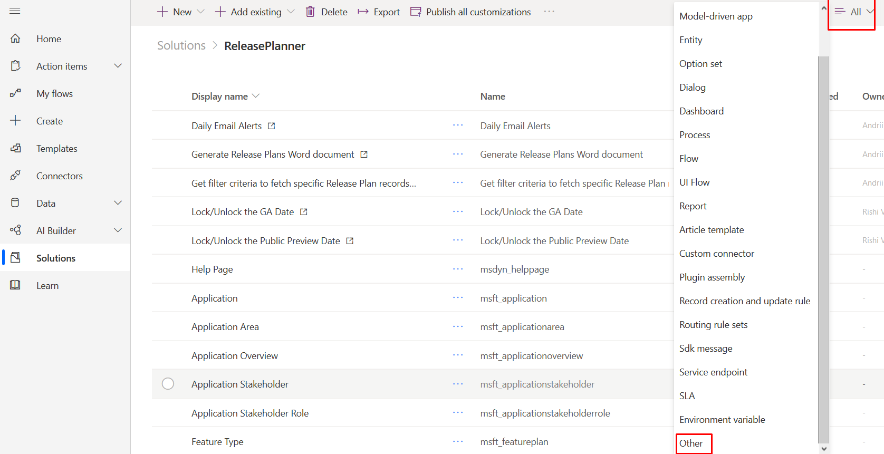

16. Select “Generate Word Doc Ribbon script” web resource:  
    

    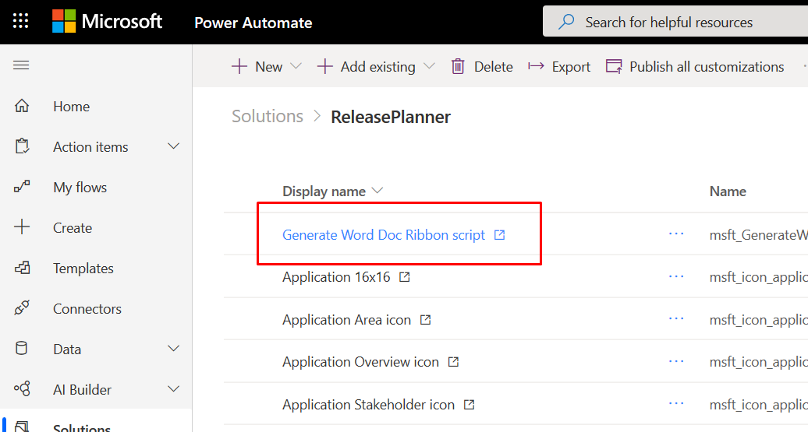

17. Select “Text Editor”:  
    

    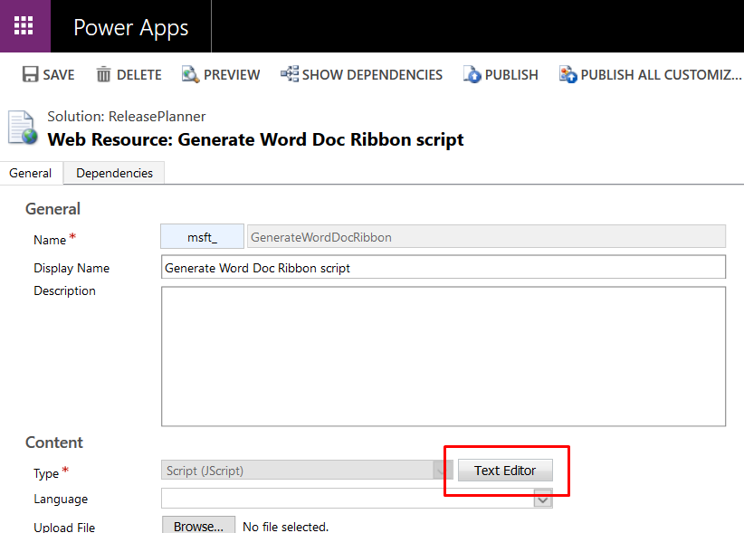

18. Find “flowUrl” variable and replace its value with the URL copied on step
    1.14:  Click OK.
    

    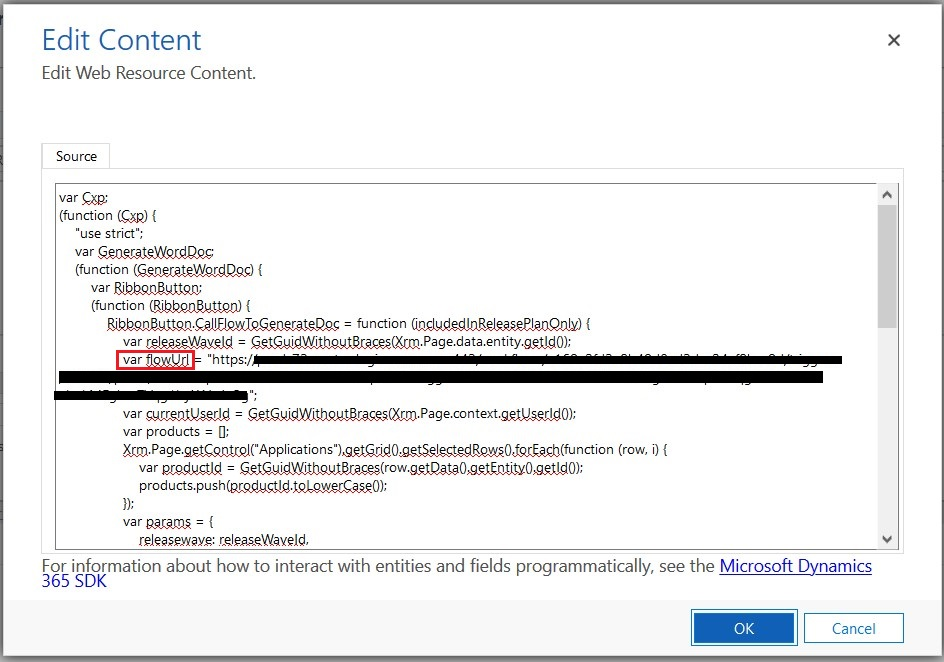

#### Configure “Daily Email Alerts” flow

1.  On the environment where you have imported the solution go to “Solutions”
    using the Modern UI:  
    

    

2.  Select “Release Planner” solution:  
    

    

3.  Select “Flow” filter on the upper right:  
    

    

4.  Select “Daily Email Alerts”  
    

    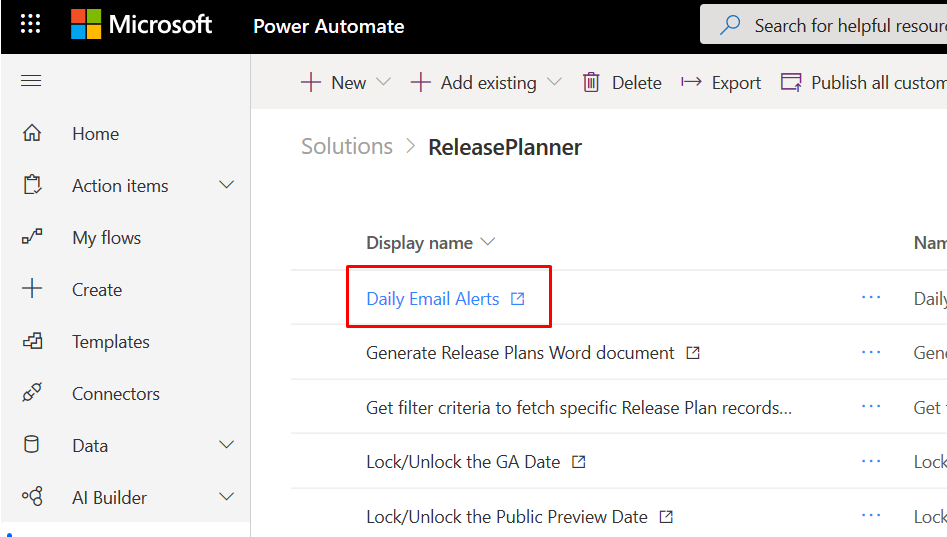

5.  Select “Edit”:  
    

    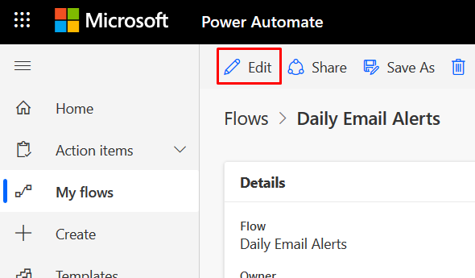

6.  Expand “Initialize Environment URL” step and enter your environment URL into
    the “Value” field:  
    

    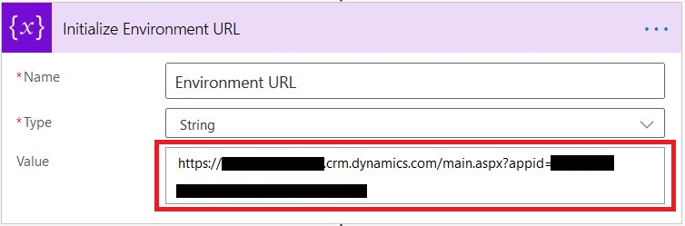

    Click save and close the Flow.
