# Release Planner Solution
Earlier, we published a [blog](https://powerapps.microsoft.com/en-us/blog/how-power-platform-helps-us-manage-and-publish-product-release-plans/) that is explaining how Microsoft business applications team is publishing the release plans using a Power Platform. Based on various customers' requests, we have templatized the release planner app that can be used for your organizational application rollouts.

## Package contents
|Component|	Filename |	Description
|-|-|-|
CSS | UploadImageTool.css | CSS file for the Upload Image Tool.|
Plugin Project|	ReleasePlannerPlugins.zip |	Visual Studio [Project files](#release-plan-audit-plug-in) to create Release plan History records.|
Solutions/Managed|	ReleasePlanner_1_0_0_0_managed.zip|	 A managed solution file that contains all release plan components such as client extensions, [custom control](#custom-control), [entity](#entities), [flows](#flows) help page, option set, [process](#business-rules), [security role](#security-roles), and  web resource ([JS files](#form-validators), entity icons).
Solutions/Un Managed |	ReleasePlanner_1_0_0_0.zip|	 An Unmanaged solution file that contains all release plan components such as client extensions, [custom control](#custom-control), [entity](#entities), [flows](#flows) help page, option set, [process](#business-rules), [security role](#security-roles), and  web resource ([JS files](#form-validators), entity icons).
Template |	HTML.htm|	Template file used for creating release plan Word document.|
|Index | index.ts | Used in the Custom Image upload control solution.|

## Prerequisites
 
The following apps must be available :

- Dynamics 365 apps such as Dynamics 365 Sales, Dynamics 365 Customer Service, Dynamics 365 Marketing, Dynamics 365 Field Service, and Dynamics 365 Project Service Automation.

- A service account that has admin access in Dynamics 365 and SharePoint applications.

## Audience

This article is intended for the users with System administrator privileges to
the following apps

-   Dynamics 365 apps such as Dynamics 365 Sales, Dynamics 365 Customer Service, Dynamics 365 Marketing, Dynamics 365 Field Service, and Dynamics 365 Project Service Automation.

-   Power Apps

-   Power Automate

-   SharePoint Contributor privilege to create/read documents.

## Download pack
Directly [download all assets](https://github.com/microsoft/powerapps-tools/raw/master/Apps/ReleasePlanner/ReleasePlanner.zip).

## Deployment
Follow the [deployment instructions](deployment.md) to install the solution and configure the Flows.

## Entities

The following are the list of entities available in the solution. The detailed
documentation for each entity's attributes is available as a [Guided
help](https://docs.microsoft.com/en-us/powerapps/maker/common-data-service/create-custom-help-pages)
within the solution. Follow the instructions in the link to enable guided help
in your environment to see the detail documentation

### Entity Relationship diagram

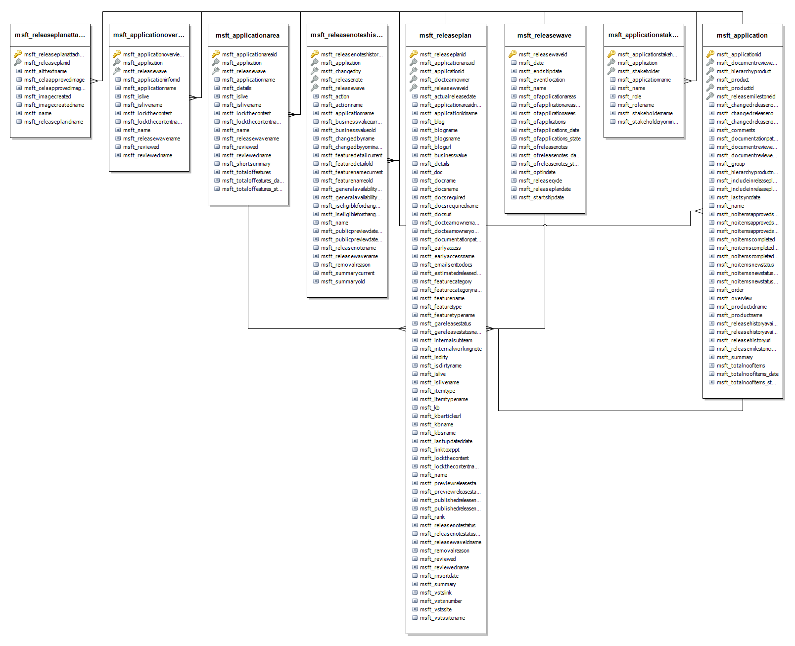

## Flows

The solution contains 5 flows.

### Daily Email Alerts

This flow sends email alerts to the Reviewer to review the release plans that
are created/updated by the author. The release plans that are set as “Reviewed?”
to No will be included for review. The flow includes the following checks:

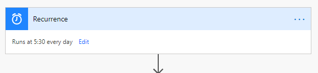

1.  Pending Application Overview reviews (Reviewed ? is No)

    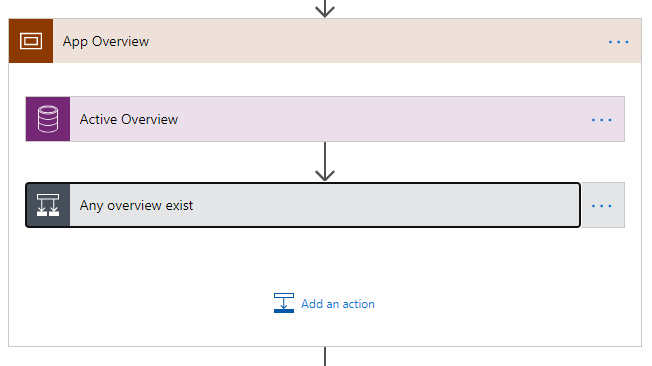

2.  Pending Application Area reviews (Reviewed? is No)

    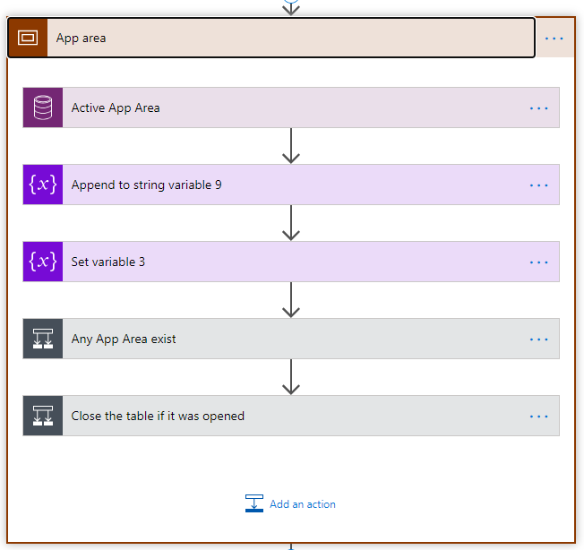

3.  Pending Release plan reviews (Reviewed? is No)

    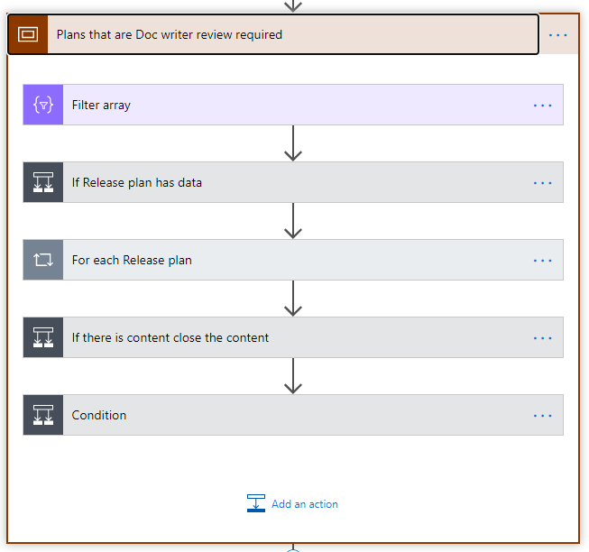

4.  Images that are added in the last 24 hours

    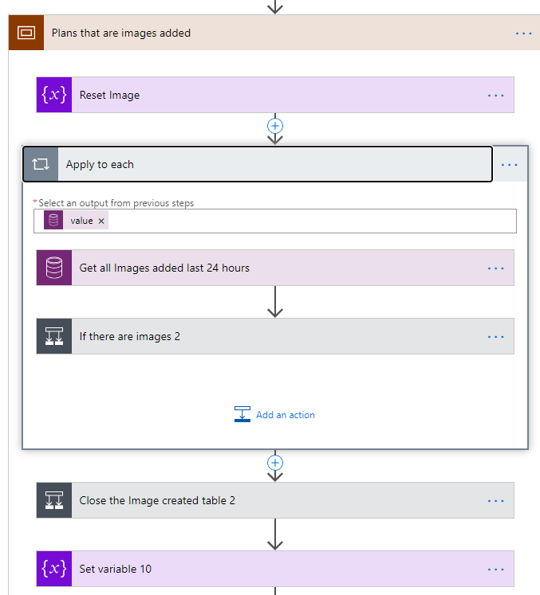

5.  Release Plans that are in shipped status with no documentation link

    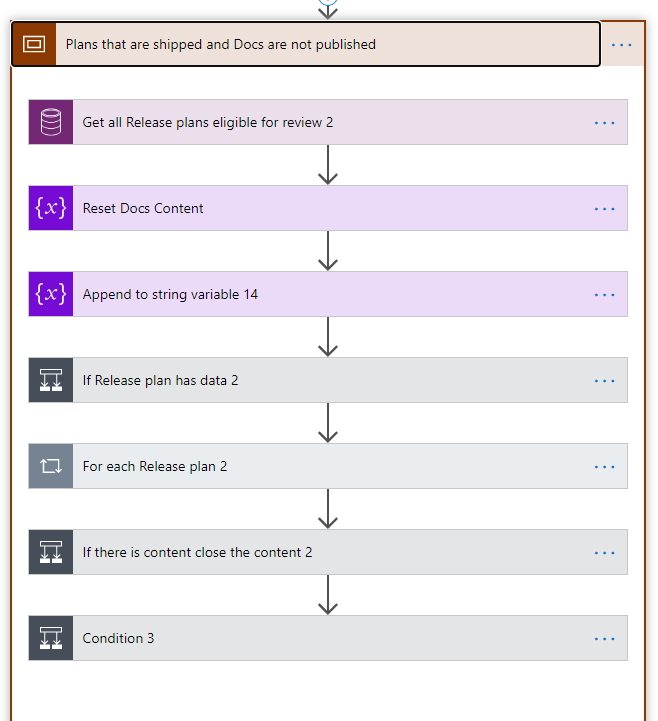

### Generate Release Plans Word Document

This flow is useful to generate a Word document that includes all the release
plans for a specific wave and a specific product. The Word document will help the leadership team to
review all the plans offline.

The "Generate Document" menu triggers this flow on the Release Wave entity
form. The flow produces a .doc file with information about the selected
applications and saves the file to a SharePoint folder. Once the file has been
saved, the flow sends an email with a link to the file.

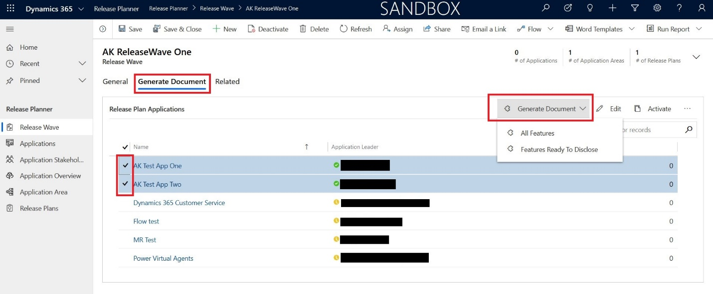

#### Steps to generate a .doc file

1.  Open the update form for the Release Wave you are interested in.

2.  Select the “Generate Document” tab.

3.  In “Release Plan Applications” sub-grid select the applications, details of
    which must be included in the .doc file.

4.  Select “Generate Document” and then select one of the two options:

    - “All Features”: the generated .doc file will include details about all
        features associated with the selected applications. If no application is
        selected, the document will include all the active applications in the
        system.

    - “Features Ready to Disclose”: the generated .doc file will include
        details only about features which have “Include in Release Plan” field
        set to “Yes”.

Once the .doc file has been generated and saved to a SharePoint folder, you will
receive an email with a link to the file.

### Get filter criteria to fetch specific Release Plan records.

This flow is called by the “Generate Release Plans Word document” flow to retrieve
criteria, with which Release Plans will be filtered.

“Get filter criteria to fetch specific Release Plan records” flow allows you to
apply custom filter criteria when needed.

### Set App Overview name when released app updated

Updates Application Overview name if the application name gets changed. Sets the
overview name in the format "Overview of \<app name\>". Triggers when
Application field of Application Overview entity is created, updated, or
deleted.

### Set overview name when app name changed

Updates Application Overview name if another application is selected for the
overview. Triggers when the application record is created, updated or deleted.

## Business Rules
 
### Lock/Unlock the Public Preview Date

If Public Preview Release Status is N/A, the Public Preview Date field must be
locked.

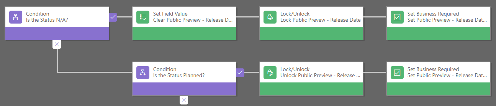

### Lock/Unlock the GA Date

If GA Release Status is N/A, the GA Date field must be locked.

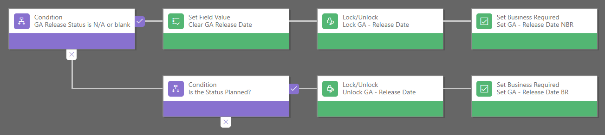

## Form Validators

Additional field validations are performed for status/date fields on Release
Plan form to match the expected behavior:

-   Dates must be not less than today with Planned status

-   Dates must be not greater than today with the Shipped status

-   N/A status locks GA – Release date field

-   At least one of specified dates must be within the related Release Wave
    timeline (otherwise Include in Release Plan also gets locked)

-   Public preview date must be less than GA date

These rules are processed by msft_releaseplan.js script. The script is available
under the "Web Resources" tab in the solution window. All triggered functions are
associated with corresponding events which can be changed in form editor
(Solution \> Entities \> Release Plan \> Forms \> Reviewer/Contributor form \>
Form Properties):

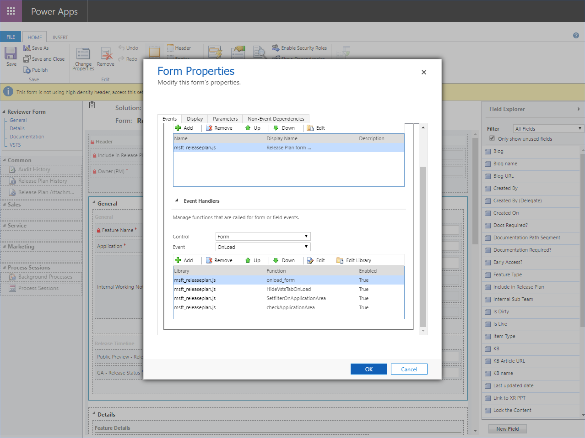

## Custom Control

The image upload control will help the user to upload the image from the local device to the app. The image is stored in the "release planner attachment" entity's note entity.

Apart from default PCF files, it contains “index.ts” for processing the data and
UploadImageTool.css for component styling. ControlManifest.Input.xml contains
PCF name, version, and other info plus all parameters visible after selecting it
in the form editor. These can be used to adjust the size of the control components.

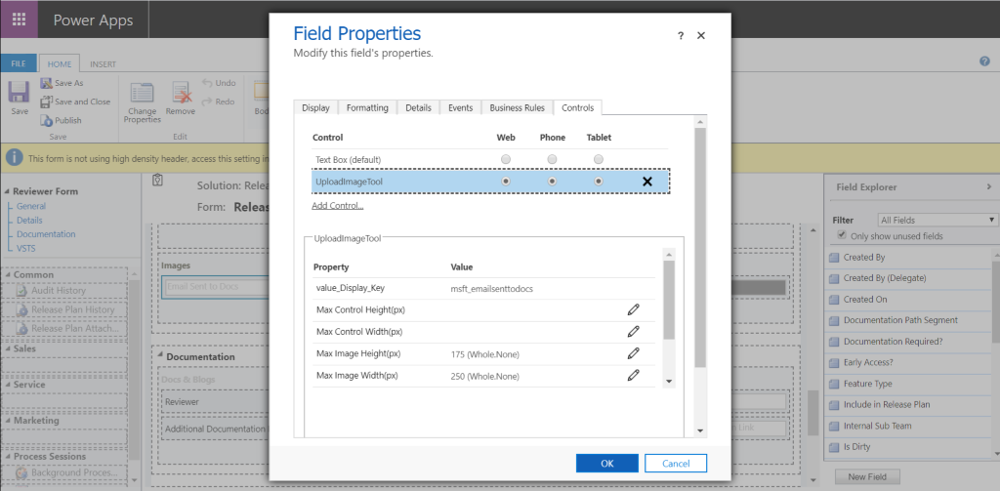

The form containing custom control:

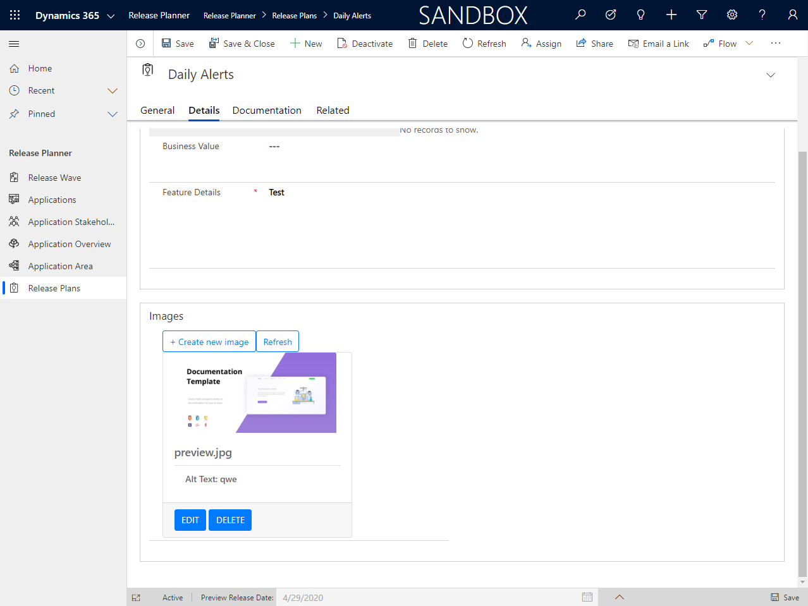

Each Release Plan may contain multiple attachments that contain the data about
the image uploaded via the Image Upload tool (filename, description, etc.). In turn,
each Release Plan Attachment is related to one of the Annotations (Notes) entities
provided out of the box, where the image in base64 format is stored. All
uploaded files can also be found by navigating to Related \> Release Plan
Attachments on Release Plan form.

## Security Roles

The following security roles are available in the solution:

| **Role Name**                  |   **Role Description**          |
|-------------------------------------|-------------------------------|
| Release Plan – Admin       | This is the administrative role. Users with this role have access to all forms and can make any changes.                                                                                                                                                                  |
| Release Plan – Contributor | This role is designed for content authors. Users with this role have access to **Contributor** forms of Release Plan, Application Area, and Application Overview entities. On Contributor forms of these entities, **“Reviewed?” field is always read-only**.               |
| Release Plan – Reviewer    | This role is designed for content reviewers. Users with this role have access to **Reviewer** forms of Release Plan, Application Area, and Application Overview entities. On Reviewer forms of these entities, the **“Include in Release Plan” field is always read-only**. |

## Release Plan Audit Plug-in
  

### Release Plan Audit Plug-in purpose and logic

Release Plan Audit Plug-in is used to automatically create a Release Plan
History record whenever an operation, which meets certain conditions, is
performed on a Release Plan. The following table lists those operations with
their corresponding conditions:

| **Operation type**                  | **Conditions**                                                                                                                                                                                                                                                                                                                                                        | **Release Plan History “Action” field value** |
|-------------------------------------|-----------------------------------------------------------------------------------------------------------------------------------------------------------------------------------------------------------------------------------------------------------------------------------------------------------------------------------------------------------------------|-----------------------------------------------|
| A new Release Plan is created.       | The creation date is equal to or later than the “Release Plan Cut-off Date” of the Release Wave, to which the new Release Plan belongs.                                                                                                                                                                                                                               | “Created”                                     |
| An existing Release Plan is updated | \- “Include in Release Plan” value has been changed - The date of change is equal to or later than the “Release Plan Cut-off Date” of the Release Wave, to which the Release Plan belongs.                                                                                                                                                                                | “Added” or “Removed”                          |
|   An existing Release Plan is updated                                  | \- “Public Preview – Release Date” **and/or** “GA – Release Date” value has been changed **-** The new date(s) is (are) between “Release Start Date” and “Release End Date” of the Release Wave, to which the Release Plan belongs - The date of change is equal to or later than “Release Plan Cut-off Date” of the Release Wave, to which the Release Plan belongs. | “Updated”                                     |

### Steps to access Release Plan History records

1.  Open Update form for the Release Plan you are interested in.

2.  Select the “Related” tab and then “Release Plan History”.

### Disclaimer
*This app is a sample and may be used with Microsoft Power Apps for dissemination of reference information only.*
